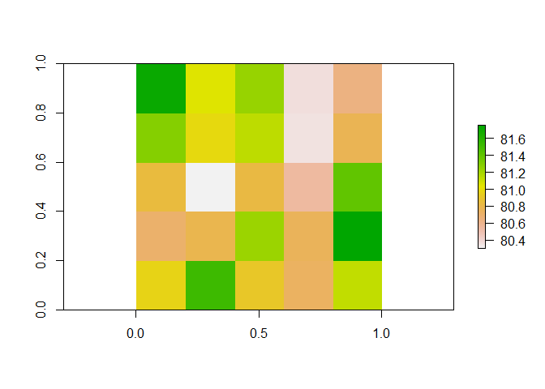

Calculating the Biodiversity Intactness Index
================
Adriana De Palma
07 February, 2019

-   [About PREDICTS](#about-predicts)
-   [About BII](#about-bii)
-   [Load some packages](#load-some-packages)
-   [Prepare the biodiversity data](#prepare-the-biodiversity-data)
-   [Calculate diversity indices](#calculate-diversity-indices)
    -   [Total Abundance](#total-abundance)
    -   [Compositional Similarity](#compositional-similarity)
-   [Run the statistical analysis](#run-the-statistical-analysis)
    -   [Total Abundance](#total-abundance-1)
    -   [Compositional Similarity](#compositional-similarity-1)
-   [Projecting the model](#projecting-the-model)
    -   [Model predictions](#model-predictions)
    -   [Gather land-use rasters](#gather-land-use-rasters)
    -   [Spatial projections of BII](#spatial-projections-of-bii)
-   [Extensions](#extensions)
-   [Advantages](#advantages)
-   [Limitations](#limitations)

This tutorial gives a step-by-step guide on how to calculate the Biodiversity Intactness Index (BII) using the PREDICTS database. We'll go through where to find the PREDICTS data, how we go about analysing this data and finally how to project and calculate BII. We'll be using just a subset of the data and a very simple model to start with.

About PREDICTS
==============

About BII
=========

Load some packages
==================

``` r
library(dplyr) # for easy data manipulation
library(tidyr) # ditto
library(magrittr) # for piping
library(lme4) # for mixed effects models
library(car) # for logit transformation with adjustment
library(raster) # for working with raster data
library(geosphere) # calculating geographic distance between sites
library(foreach) # running loops
library(doParallel) # running loops in parallel
```

Prepare the biodiversity data
=============================

You can download the PREDICTS data from the <a href="http://data.nhm.ac.uk/dataset/the-2016-release-of-the-predicts-database" target="_blank">Natural History Museum data portal<a/>. If you're working in `R`, I would strongly suggest downloading `database.rds` (the database is very large, and the rds file is much quicker to load in than the csv file).

Once you've downloaded the database, read it in. I'm going to filter the data for just the Americas, to make the data manipulation and modelling a bit quicker. You can calculate BII for *any* region of the world for which there are data, although we tend to do our BII modelling on a global scale or at least across multiple biomes.

``` r
# read in the data
diversity <- readRDS("database.rds") %>%
  
  # now let's filter out just the data for the Americas
  filter(UN_region == "Americas")

head(diversity)
```

    ##          Source_ID          Reference Study_number
    ## 1 AD1_2005__Shuler Shuler et al. 2005            1
    ## 2 AD1_2005__Shuler Shuler et al. 2005            1
    ## 3 AD1_2005__Shuler Shuler et al. 2005            1
    ## 4 AD1_2005__Shuler Shuler et al. 2005            1
    ## 5 AD1_2005__Shuler Shuler et al. 2005            1
    ## 6 AD1_2005__Shuler Shuler et al. 2005            1
    ##                    Study_name                 SS
    ## 1 Shuler2005_flowervisitation AD1_2005__Shuler 1
    ## 2 Shuler2005_flowervisitation AD1_2005__Shuler 1
    ## 3 Shuler2005_flowervisitation AD1_2005__Shuler 1
    ## 4 Shuler2005_flowervisitation AD1_2005__Shuler 1
    ## 5 Shuler2005_flowervisitation AD1_2005__Shuler 1
    ## 6 Shuler2005_flowervisitation AD1_2005__Shuler 1
    ##             Diversity_metric        Diversity_metric_unit
    ## 1 effort-corrected abundance effort-corrected individuals
    ## 2 effort-corrected abundance effort-corrected individuals
    ## 3 effort-corrected abundance effort-corrected individuals
    ## 4 effort-corrected abundance effort-corrected individuals
    ## 5 effort-corrected abundance effort-corrected individuals
    ## 6 effort-corrected abundance effort-corrected individuals
    ##   Diversity_metric_type Diversity_metric_is_effort_sensitive
    ## 1             Abundance                                FALSE
    ## 2             Abundance                                FALSE
    ## 3             Abundance                                FALSE
    ## 4             Abundance                                FALSE
    ## 5             Abundance                                FALSE
    ## 6             Abundance                                FALSE
    ##   Diversity_metric_is_suitable_for_Chao      Sampling_method
    ## 1                                 FALSE systematic searching
    ## 2                                 FALSE systematic searching
    ## 3                                 FALSE systematic searching
    ## 4                                 FALSE systematic searching
    ## 5                                 FALSE systematic searching
    ## 6                                 FALSE systematic searching
    ##   Sampling_effort_unit Study_common_taxon Rank_of_study_common_taxon
    ## 1                  day        Hymenoptera                      Order
    ## 2                  day        Hymenoptera                      Order
    ## 3                  day        Hymenoptera                      Order
    ## 4                  day        Hymenoptera                      Order
    ## 5                  day        Hymenoptera                      Order
    ## 6                  day        Hymenoptera                      Order
    ##   Site_number           Site_name Block                  SSS
    ## 1           1      Ayrshire Farms       AD1_2005__Shuler 1 1
    ## 2           1      Ayrshire Farms       AD1_2005__Shuler 1 1
    ## 3           1      Ayrshire Farms       AD1_2005__Shuler 1 1
    ## 4           1      Ayrshire Farms       AD1_2005__Shuler 1 1
    ## 5           1      Ayrshire Farms       AD1_2005__Shuler 1 1
    ## 6           2 Over the Grass Farm       AD1_2005__Shuler 1 2
    ##                   SSB                  SSBS Sample_start_earliest
    ## 1 AD1_2005__Shuler 1  AD1_2005__Shuler 1  1            2003-07-07
    ## 2 AD1_2005__Shuler 1  AD1_2005__Shuler 1  1            2003-07-07
    ## 3 AD1_2005__Shuler 1  AD1_2005__Shuler 1  1            2003-07-07
    ## 4 AD1_2005__Shuler 1  AD1_2005__Shuler 1  1            2003-07-07
    ## 5 AD1_2005__Shuler 1  AD1_2005__Shuler 1  1            2003-07-07
    ## 6 AD1_2005__Shuler 1  AD1_2005__Shuler 1  2            2003-07-07
    ##   Sample_end_latest Sample_midpoint Sample_date_resolution
    ## 1        2003-08-05      2003-07-21                    day
    ## 2        2003-08-05      2003-07-21                    day
    ## 3        2003-08-05      2003-07-21                    day
    ## 4        2003-08-05      2003-07-21                    day
    ## 5        2003-08-05      2003-07-21                    day
    ## 6        2003-08-05      2003-07-21                    day
    ##   Max_linear_extent_metres Habitat_patch_area_square_metres
    ## 1                 2844.946                          4046856
    ## 2                 2844.946                          4046856
    ## 3                 2844.946                          4046856
    ## 4                 2844.946                          4046856
    ## 5                 2844.946                          4046856
    ## 6                 1505.404                          1133120
    ##   Sampling_effort Rescaled_sampling_effort   Habitat_as_described
    ## 1               1                        1 Squash or pumpkin farm
    ## 2               1                        1 Squash or pumpkin farm
    ## 3               1                        1 Squash or pumpkin farm
    ## 4               1                        1 Squash or pumpkin farm
    ## 5               1                        1 Squash or pumpkin farm
    ## 6               1                        1 Squash or pumpkin farm
    ##   Predominant_land_use  Source_for_predominant_land_use Use_intensity
    ## 1             Cropland Direct from publication / author     Light use
    ## 2             Cropland Direct from publication / author     Light use
    ## 3             Cropland Direct from publication / author     Light use
    ## 4             Cropland Direct from publication / author     Light use
    ## 5             Cropland Direct from publication / author     Light use
    ## 6             Cropland Direct from publication / author     Light use
    ##   Km_to_nearest_edge_of_habitat Years_since_fragmentation_or_conversion
    ## 1                            NA                                      NA
    ## 2                            NA                                      NA
    ## 3                            NA                                      NA
    ## 4                            NA                                      NA
    ## 5                            NA                                      NA
    ## 6                            NA                                      NA
    ##   Transect_details               Coordinates_method Longitude Latitude
    ## 1                  Direct from publication / author -77.86848 38.95733
    ## 2                  Direct from publication / author -77.86848 38.95733
    ## 3                  Direct from publication / author -77.86848 38.95733
    ## 4                  Direct from publication / author -77.86848 38.95733
    ## 5                  Direct from publication / author -77.86848 38.95733
    ## 6                  Direct from publication / author -77.78402 38.83562
    ##   Country_distance_metres       Country  UN_subregion UN_region
    ## 1                       0 United States North America  Americas
    ## 2                       0 United States North America  Americas
    ## 3                       0 United States North America  Americas
    ## 4                       0 United States North America  Americas
    ## 5                       0 United States North America  Americas
    ## 6                       0 United States North America  Americas
    ##   Ecoregion_distance_metres Ecoregion                               Biome
    ## 1                         0  Piedmont Temperate Broadleaf & Mixed Forests
    ## 2                         0  Piedmont Temperate Broadleaf & Mixed Forests
    ## 3                         0  Piedmont Temperate Broadleaf & Mixed Forests
    ## 4                         0  Piedmont Temperate Broadleaf & Mixed Forests
    ## 5                         0  Piedmont Temperate Broadleaf & Mixed Forests
    ## 6                         0  Piedmont Temperate Broadleaf & Mixed Forests
    ##      Realm Hotspot Wilderness_area Taxon_number        Taxon_name_entered
    ## 1 Nearctic                                    1            Apis mellifera
    ## 2 Nearctic                                    2        Peponapis pruinosa
    ## 3 Nearctic                                    3 Auglochlorini/Agapostemon
    ## 4 Nearctic                                    4     Melissodes bimaculata
    ## 5 Nearctic                                    5                    Bombus
    ## 6 Nearctic                                    1            Apis mellifera
    ##                       Indication               Parsed_name
    ## 1 Hymenoptera: Apidae sensu lato            Apis mellifera
    ## 2 Hymenoptera: Apidae sensu lato        Peponapis pruinosa
    ## 3 Hymenoptera: Apidae sensu lato Auglochlorini/Agapostemon
    ## 4 Hymenoptera: Apidae sensu lato     Melissodes bimaculata
    ## 5 Hymenoptera: Apidae sensu lato                    Bombus
    ## 6 Hymenoptera: Apidae sensu lato            Apis mellifera
    ##                   Taxon   COL_ID   Name_status    Rank  Kingdom     Phylum
    ## 1        Apis mellifera  6845885 accepted name Species Animalia Arthropoda
    ## 2    Peponapis pruinosa  6927991 accepted name Species Animalia Arthropoda
    ## 3            Halictidae 13025322 accepted name  Family Animalia Arthropoda
    ## 4 Melissodes bimaculata  6927813 accepted name Species Animalia Arthropoda
    ## 5                Bombus 13122214 accepted name   Genus Animalia Arthropoda
    ## 6        Apis mellifera  6845885 accepted name Species Animalia Arthropoda
    ##     Class       Order     Family      Genus    Species
    ## 1 Insecta Hymenoptera     Apidae       Apis  mellifera
    ## 2 Insecta Hymenoptera     Apidae  Peponapis   pruinosa
    ## 3 Insecta Hymenoptera Halictidae                      
    ## 4 Insecta Hymenoptera     Apidae Melissodes bimaculata
    ## 5 Insecta Hymenoptera     Apidae     Bombus           
    ## 6 Insecta Hymenoptera     Apidae       Apis  mellifera
    ##     Best_guess_binomial Higher_taxon Measurement
    ## 1        Apis mellifera  Hymenoptera        0.00
    ## 2    Peponapis pruinosa  Hymenoptera        0.75
    ## 3                        Hymenoptera        0.00
    ## 4 Melissodes bimaculata  Hymenoptera        0.00
    ## 5                        Hymenoptera        0.00
    ## 6        Apis mellifera  Hymenoptera        0.00
    ##   Effort_corrected_measurement
    ## 1                         0.00
    ## 2                         0.75
    ## 3                         0.00
    ## 4                         0.00
    ## 5                         0.00
    ## 6                         0.00

Now let's explore the data a little.

``` r
table(diversity$Predominant_land_use, diversity$Use_intensity)
```

    ##                                           
    ##                                            Minimal use Light use
    ##   Primary vegetation                            163302     73282
    ##   Young secondary vegetation                     36731      9427
    ##   Intermediate secondary vegetation              51349     12968
    ##   Mature secondary vegetation                    39909      5936
    ##   Secondary vegetation (indeterminate age)       44260     10349
    ##   Plantation forest                               9046     18478
    ##   Pasture                                        38321     93577
    ##   Cropland                                       13184     37887
    ##   Urban                                           7431      5547
    ##   Cannot decide                                      0         0
    ##                                           
    ##                                            Intense use Cannot decide
    ##   Primary vegetation                             22783         12828
    ##   Young secondary vegetation                      3673          7467
    ##   Intermediate secondary vegetation               1041          5135
    ##   Mature secondary vegetation                      396          2814
    ##   Secondary vegetation (indeterminate age)         373          5407
    ##   Plantation forest                               9429          2985
    ##   Pasture                                         2612         29274
    ##   Cropland                                       18751         24188
    ##   Urban                                           1772           332
    ##   Cannot decide                                      0          3438

There's lots of data for the Americas across all land-use and intensity classes. Since we're using a simplified model for illustration purposes, we're not going to look at *all* the use intensities here. However, we will keep *minimally-used primary vegetation* separate, as this is the closest we have to a *pristine* baseline.

So let's collapse down the data. Note that I'm doing this purely to make the example simpler. In reality, we include multiple land use and intensity combinations, including the age of secondary vegetation when possible.

``` r
diversity <- diversity %>%
  # make a level of Primary minimal. Everything else gets the coarse land use
  mutate(
    LandUse = ifelse(Predominant_land_use == "Primary vegetation" & Use_intensity == "Minimal use",
                     "Primary minimal",
                     paste(Predominant_land_use)),
    
    # collapse the secondary vegetation classes together
    LandUse = ifelse(grepl("secondary", tolower(LandUse)),
                     "Secondary vegetation",
                     paste(LandUse)),
    
    # change cannot decide into NA
    LandUse = ifelse(Predominant_land_use == "Cannot decide",
                     NA, 
                     paste(LandUse)),
    
    # relevel the factor so that Primary minimal is the first level (so that it is the intercept term in models)
    LandUse = factor(LandUse),
    LandUse = relevel(LandUse, ref = "Primary minimal")
  )
```

Calculate diversity indices
===========================

The Biodiversity Intactness Index is derived from combining two models: one of total abundance, and one of compositional similarity. We're going to calculate these diversity metrics now.

Total Abundance
---------------

Total abundance is simply the sum of all individuals sampled at each site.

``` r
abundance_data <- diversity %>%
  
  # pull out just the abundance measures
  filter(Diversity_metric_type == "Abundance") %>%
  
  # group by SSBS (each unique value corresponds to a unique site)
  group_by(SSBS) %>%
  
  # now add up all the abundance measurements within each site
  mutate(TotalAbundance = sum(Effort_corrected_measurement)) %>%
  
  # ungroup
  ungroup() %>%
  
  # pull out unique sites
  distinct(SSBS, .keep_all = TRUE) %>%
  
  # now group by Study ID
  group_by(SS) %>%
  
  # pull out the maximum abundance for each study
  mutate(MaxAbundance = max(TotalAbundance)) %>%
  
  # ungroup
  ungroup() %>%
  
  # now rescale total abundance, so that within each study, abundance varies from 0 to 1.
  mutate(RescaledAbundance = TotalAbundance/MaxAbundance)
```

Compositional Similarity
------------------------

We use the *asymmetric Jaccard Index* as our measure of compositional similarity. Essentially, we want to know what species are present in our baseline sites (`Primary minimal`), and then for our converted sites (all other land uses), what proportion of individuals come from species that are also found in the baseline site.

As an example, let's look at the following simple scenario. Our primary minimal site had 15 *Species A* individuals and 30 *Species B* individuals. A cropland site has 10 *Species A* and 40 *Species C* individuals. The compositional similarity measure that we use currently would say that only 10 out of a total 50 individuals in the cropland site were from *originally present species* (i.e. *Species A*): a value of 0.2.

Now, for every study with a `Primary minimal` site, we want to calculate this compositional similarity measure against every other site in the study. Note that this has to be done *within* studies: it would be pointless to compare similarity between a site from a study of birds with a site from a study of bees.

Let's first set up the data we're going to use for the compositional similarity models.

``` r
cd_data_input <- diversity %>%
  
  # drop any rows with unknown LandUse
  filter(!is.na(LandUse)) %>%
  
  # pull out only the abundance data
  filter(Diversity_metric_type == "Abundance") %>%
  
  # group by Study
  group_by(SS) %>%
  
  # calculate the number of unique sampling efforts within that study
  mutate(n_sample_effort = n_distinct(Sampling_effort)) %>%
  
  # calculate the number of unique species sampled in that study
  mutate(n_species = n_distinct(Taxon_name_entered)) %>%
  
  # check if there are any Primary minimal sites in the dataset
  mutate(n_primin_records = sum(LandUse == "Primary minimal")) %>%
  
  # ungroup
  ungroup() %>%
  
  # now keep only the studies with one unique sampling effort
  filter(n_sample_effort == 1) %>%
  
  # and keep only studies with more than one species 
  # as these studies clearly aren't looking at assemblage-level diversity
  filter(n_species > 1) %>%
  
  # and keep only studies with at least some Primary minimal data
  filter(n_primin_records > 0) %>%
  
  # drop empty factor levels
  droplevels()
```

Now we'll set up a function to calculate compositional similarity between a single pair of sites in a study.

``` r
getJacAbSym <- function(s1, s2, data){

  # get the list of species that are present in site 1 (i.e., their abundance was greater than 0)
  s1species <- data %>%
    
    # filter out the SSBS that matches s1
    filter(SSBS == s1) %>%
    
    # filter out the species where the Measurement (abundance) is greater than 0
    filter(Measurement > 0) %>%
    
    # get the unique species from this dataset
    distinct(Taxon_name_entered) %>%
    
    # pull out the column into a vector
    pull
  
  # for site 2, get the total abundance of species that are also present in site 1
  
  s2abundance_s1species <- data %>%
    
    # filter out the SSBS that matches s2
    filter(SSBS == s2) %>%
    
    # filter out the species that are also present in site 1
    filter(Taxon_name_entered %in% s1species) %>%
    
    # pull out the Measurement into a vector
    pull(Measurement) %>%
    
    # calculate the sum
    sum()
  
  # calculate the total abundance of all species in site 2
  s2_sum <- data %>%
    
    # filter out the SSBS that matches s2
    filter(SSBS == s2) %>%
    
    # pull out the measurement column (the abundance)
    pull(Measurement) %>%
    
    # calculate the sum
    sum() 
  
  
  # Now calculate the compositional similarity
  # this is the number of individuals of species also found in s1, divided by the total abundance in s2 
  # so that equates to the proportion of individuals in s2 that are of species also found in s1
  
  sor <- s2abundance_s1species / s2_sum

  
  # if there are no taxa in common, then sor = 0
  # if abundances of all taxa are zero, then similarity becomes NaN.
  return(sor)
  
  }
```

Now that we've set up all the functions to gather the data for the compositional similarity models, let's get the dataset. We'll first get together a vector of all the study IDs that we need to perform the calculations for.

``` r
# get a vector of each study to loop over
studies <- distinct(cd_data_input, SS) %>%
  pull()
```

Now we have to loop over each element in `studies` and calculate:

1.  the compositional similarity between each pair of sites
2.  the geographic distance between each pair of sites
3.  the land uses for each pair of sites

I'm going to do this in parallel, as we're looping over a lot of studies.

``` r
registerDoParallel(cores = 2)

# If you're not familiar with loops (or with foreach loops):
# I'm going to loop over every element (s) in studies and combine the results of each loop by rbinding them into one large dataset. Since we're using functions from different packages within this loop, we need to specify them (if you don't do the loop in parallel, this isn't necessary)
cd_data <- foreach(s = studies, 
                   .combine = rbind,
                   .packages = c("dplyr", "magrittr", "geosphere")) %dopar% {
  
  # filter out the given study
  data_ss <- filter(cd_data_input, SS == s)
  
  # pull out the SSBS and LandUse information (we'll use this later to assign a land use contrast to each pair of site
  site_data <- data_ss %>%
    dplyr::select(SSBS, LandUse) %>%
    distinct(SSBS, .keep_all = TRUE)
  
  # pull out the sites that are Primary minimal (we only want to use comparisons with the baseline)
  baseline_sites <- site_data %>%
    filter(LandUse == "Primary minimal") %>%
    pull(SSBS)
  
  # pull out all the sites
  site_list <- site_data %>%
    pull(SSBS)
  

  # get all site x site comparisons for this study
  site_comparisons <- expand.grid(baseline_sites, site_list) %>%
    
    # rename the columns so they will be what the compositional similarity function expects for ease
    rename(s1 = Var1, s2 = Var2) %>%
    
    # remove the comparisons where the same site is being compared to itself
    filter(s1 != s2)
    
  
  # apply the compositional similarity function over each site combination in the dataset
  sor <- apply(site_comparisons, 1, function(y) getJacAbSym(data = data_ss, s1 = y['s1'], s2 = y['s2']))
  
  # calculate the geographic distance between sites
  # first pull out the lat and longs for each site combination
  s1LatLong <- as.matrix(data_ss[match(site_comparisons$s1, data_ss$SSBS), c('Longitude','Latitude')])
  s2LatLong <- as.matrix(data_ss[match(site_comparisons$s2, data_ss$SSBS), c('Longitude','Latitude')])

  # then calculate the distance between sites
  dist <- distHaversine(s1LatLong, s2LatLong)

  # pull out the land-use contrast for those site combinations
  Contrast <- paste(site_data$LandUse[match(site_comparisons$s1, site_data$SSBS)],
                    site_data$LandUse[match(site_comparisons$s2, site_data$SSBS)], 
                    sep = "-")
  
  # put all the information into a single dataframe
  
  study_results <- data.frame(site_comparisons,
                              sor,
                              dist,
                              Contrast,
                              SS = s,
                              stringsAsFactors = TRUE)

  
  
}

# stop running things in parallel
registerDoSEQ()
```

Run the statistical analysis
============================

In the PREDICTS database, most of the variation in diversity is going to be between Studies - each study looks at different groups in different areas using different sampling methods. This has to be accounted for in the statistical analysis. We do this in a mixed effects framework: we treat studies and blocks as random effects.

Total Abundance
---------------

Let's start with a simple model of total abundance. Note that the errors in models of ecological abundance are generally non-normal. Usually, we would deal with that by modelling abundance with an error structure, such as poisson or quasipoisson. However, in the PREDICTS database, we take quite a broad view of what counts as an 'abundance' measurement - they are not all whole individuals so they aren't whole numbers. The `lme4` package doesn't really like you using a discrete error structure with continuous data. So instead, we must transform the data. Generally, a log-transformation does well, but in some cases, a square-root transformation helps to normalise the errors. *I'm not going to go through model checking with you here - this is all just to give you an idea of how to model BII, not how to do statistical analysis... Please check your residual plots etc before using models to make inferences and spatial projections!*

``` r
# run a simple model
ab_m <- lmer(sqrt(RescaledAbundance) ~ LandUse + (1|SS) + (1|SSB), data = abundance_data)
summary(ab_m)
```

    ## Linear mixed model fit by REML ['lmerMod']
    ## Formula: sqrt(RescaledAbundance) ~ LandUse + (1 | SS) + (1 | SSB)
    ##    Data: abundance_data
    ## 
    ## REML criterion at convergence: -3150.3
    ## 
    ## Scaled residuals: 
    ##     Min      1Q  Median      3Q     Max 
    ## -3.6754 -0.5860 -0.0550  0.5641  4.4054 
    ## 
    ## Random effects:
    ##  Groups   Name        Variance Std.Dev.
    ##  SSB      (Intercept) 0.006043 0.07774 
    ##  SS       (Intercept) 0.025521 0.15975 
    ##  Residual             0.033383 0.18271 
    ## Number of obs: 7009, groups:  SSB, 467; SS, 216
    ## 
    ## Fixed effects:
    ##                              Estimate Std. Error t value
    ## (Intercept)                  0.651260   0.013964  46.637
    ## LandUseCropland             -0.016003   0.012746  -1.256
    ## LandUsePasture              -0.013464   0.009998  -1.347
    ## LandUsePlantation forest    -0.054914   0.013446  -4.084
    ## LandUsePrimary vegetation   -0.022285   0.009904  -2.250
    ## LandUseSecondary vegetation  0.034908   0.009004   3.877
    ## LandUseUrban                -0.066293   0.020714  -3.200
    ## 
    ## Correlation of Fixed Effects:
    ##             (Intr) LndUsC LndUsP LndUPf LndUPv LndUSv
    ## LndUsCrplnd -0.259                                   
    ## LandUsePstr -0.284  0.492                            
    ## LndUsPlnttf -0.268  0.232  0.294                     
    ## LndUsPrmryv -0.283  0.328  0.411  0.332              
    ## LndUsScndrv -0.367  0.422  0.527  0.380  0.510       
    ## LandUseUrbn -0.164  0.193  0.205  0.141  0.270  0.250

The model shows that all land uses except for secondary vegetation have significantly reduced diversity relative to the baseline (minimally-used primary vegetation). We've just run a very simple model here, but you can add in additional human pressures (e.g., human population density).

Compositional Similarity
------------------------

Now let's do a model of compositional similarity. For compositional similarity models, we include a measure of the geographic distance beween sites. This allows us to discount *natural* turnover in species with distance. You can also include environmental distance (we've done this previously based on Gower's dissimilarity of climatic variables) and additional human pressures in models like this.

The compositional similarity measure we use is bounded between 0 and 1 - this means the errors will probably not be normally distributed. We've found that a logit transformation (with an adjustment to account for 0s and 1s) works well.

``` r
# there is some data manipulation we want to do before modelling
cd_data <- cd_data %>%
  
  # Firstly, we only care about comparisons where Primary minimal is the first site
  # so pull the contrast apart
  separate(Contrast, c("s1_LandUse", "s2_LandUse"), sep = "-", remove = FALSE) %>%
  
  # filter sites where s1_LandUse is the baseline site
  filter(s1_LandUse == "Primary minimal") %>%
  
  # logit transform the compositional similarity
  mutate(logitCS = logit(sor, adjust = 0.001, percents = FALSE)) %>%
  
  # log10 transform the geographic distance between sites
  mutate(log10geo = log10(dist + 1)) %>%
  
  # make primary minimal-primary minimal the baseline again
  mutate(Contrast = factor(Contrast), 
         Contrast = relevel(Contrast, ref = "Primary minimal-Primary minimal"))


# Model compositional similarity as a function of the land-use contrast and the geographic distance between sites
cd_m <- lmer(logitCS ~ Contrast + log10geo + (1|SS), data = cd_data)
summary(cd_m)
```

    ## Linear mixed model fit by REML ['lmerMod']
    ## Formula: logitCS ~ Contrast + log10geo + (1 | SS)
    ##    Data: cd_data
    ## 
    ## REML criterion at convergence: 757398.2
    ## 
    ## Scaled residuals: 
    ##     Min      1Q  Median      3Q     Max 
    ## -2.9033 -0.7263  0.0671  0.5304  3.7308 
    ## 
    ## Random effects:
    ##  Groups   Name        Variance Std.Dev.
    ##  SS       (Intercept) 6.469    2.544   
    ##  Residual             9.423    3.070   
    ## Number of obs: 148985, groups:  SS, 95
    ## 
    ## Fixed effects:
    ##                                              Estimate Std. Error t value
    ## (Intercept)                                   2.33360    0.28152   8.289
    ## ContrastPrimary minimal-Primary vegetation   -0.32459    0.03191 -10.171
    ## ContrastPrimary minimal-Urban                -1.66278    0.04343 -38.285
    ## ContrastPrimary minimal-Pasture              -1.90225    0.03146 -60.468
    ## ContrastPrimary minimal-Secondary vegetation  0.10686    0.03659   2.920
    ## ContrastPrimary minimal-Plantation forest    -0.45909    0.07290  -6.297
    ## ContrastPrimary minimal-Cropland             -1.20430    0.04511 -26.699
    ## log10geo                                     -0.28403    0.01069 -26.563
    ## 
    ## Correlation of Fixed Effects:
    ##             (Intr) CPm-Pv CnPm-U CnPm-P CPm-Sv CPm-Pf CnPm-C
    ## CntrstPm-Pv -0.026                                          
    ## CntrstPmn-U -0.005  0.285                                   
    ## CntrstPmn-P -0.022  0.296  0.164                            
    ## CntrstPm-Sv -0.043  0.238  0.120  0.286                     
    ## CntrstPm-Pf -0.038  0.172  0.109  0.118  0.165              
    ## CntrstPmn-C -0.016  0.213  0.237  0.147  0.222  0.091       
    ## log10geo    -0.138 -0.046 -0.103 -0.056 -0.035 -0.012 -0.037

Note that you can't trust the significance values of these compositional similarity values. The same site goes into multiple comparisons in the model (each Primary minimal site is compared to all other sites in the study), which will inflate the p-values. If you want to look at significance values, you'll need to run some simulations to check that the values are reliable.

Projecting the model
====================

Now we have one model (`ab_m`) telling us how land-use change influences the total abundance of species and one model (`cs_m`) that tells us what proportion of those individuals are from 'originally present species' in a community. Multiplying these together gives us the BII: the abundance of originally present species. We do this by projecting abundance and compositional similarity onto rasters of pressure data, and then multiplying the two output maps together.

Model predictions
-----------------

First of all, let's calculate the actual diversity in each land-use class, ignoring the impact of random effects (see `help(predict.merMod)` for more details on this).

``` r
# let's start with the abundance model

# set up a dataframe with all the levels you want to predict diversity for
# so all the land-use classes in your model must be in here
newdata_ab <- data.frame(LandUse = levels(abundance_data$LandUse)) %>%
  
  # now calculate the predicted diversity for each of these land-use levels
  # setting re.form = NA means random effect variance is ignored
  # then square the predictions (because we modelled the square root of abundance, so we have to back-transform it to get the real predicted values)
  mutate(ab_m_preds = predict(ab_m, ., re.form = NA) ^ 2)


# now the compositional similarity model

# set up a function to calculate the inverse logit of the adjusted logit function we used
# where f is the value to be back-transformed and a is the adjustment value used for the transformation
inv_logit <- function(f, a){
  a <- (1-2*a)
  (a*(1+exp(f))+(exp(f)-1))/(2*a*(1+exp(f)))
}

# once again, set up the dataframe with all the levels you want to predict diversity for
# because we had an extra fixed effect in this model (log10geo), we also have to set a baseline level for this
# we'll set it to 0 because we're interested in the compositional similarity when distance between sites is 0 (i.e., when distance-based turnover is discounted, what is the turnover because of land use?)
newdata_cd <- data.frame(Contrast = levels(cd_data$Contrast),
                      log10geo = 0) %>%
  mutate(cd_m_preds = predict(cd_m, ., re.form = NA) %>%
           inv_logit(a = 0.001))
```

It's these *predicted* values (`ab_m_preds` and `cd_m_preds`) that we're going to use to calculate the diversity in each cell of a land-use map. We will multiply the predicted diversity in each land-use class with the area of the cell in that land-use class. However, because we have a mixed effects model, the *absolulte* value of diversity is somewhat meaningless. Instead, we care about the *relative* diversity - how much diversity is there relative to what we'd find if the whole landscape was still minimally-used primary vegetation. So once we have the predictions, we divide by the reference value (the predicted diversity in minimally-used primary vegetation for the whole cell).

Gather land-use rasters
-----------------------

You can use any land-use data you like, but many land-use maps don't have classes that map easily onto the definitions used by PREDICTS. Noteable exceptions are land-use maps developed for the Representative Concentration Pathways (<a href="http://luh.umd.edu/data.shtml#LUH1_Data" target="_blank">LUH1<a/>) and the derived fine-resolution product developed by <a href="https://data.csiro.au/dap/landingpage?pid=csiro:15276&v=3&d=true" target="_blank">CSIRO<a/>.

I'm just going to simulate some rasters here for ease.

We've got seven land-use classes. Imagine we have seven rasters, one for each land-use class, and the cell value is the proportion of the cell assigned to that land-use class. We'll generate some random numbers for each of the land uses - let's make it mostly cropland, with a fair chunk of pasture and secondary vegetation, with just patches of natural land and urban areas.

``` r
# generate a dataframe with random numbers for the cell values for each land-use class
lus <- data.frame(pri_min = rnorm(25, mean = 50, sd = 1),
                  pri = rnorm(25, mean = 100, sd = 25),
                  plant = rnorm(25, mean = 100, sd = 25),
                  sec = rnorm(25, mean = 300, sd = 25),
                  crop = rnorm(25, mean = 1000, sd = 25),
                  pas = rnorm(25, mean = 400, sd = 25),
                  urb = rnorm(25, mean = 50, sd = 1)
                  ) %>%
  # calculate the row totals
  mutate(tot = rowSums(.)) %>%
  
  # for each land use, divide the value by the rowsum
  # this will give us the proportion of each land use in each cell
  transmute_at(1:7, funs(./tot))

# double check that the proportions of each land use sum to 1 (accounting for rounding errors)
all(zapsmall(rowSums(lus)) == 1)
```

    ## [1] TRUE

Now turn each land use into its own 5 x 5 raster.

``` r
# for each column of lus (i.e., each land use)
for(i in 1:ncol(lus)){
  
  # take the column and turn it into a 5 x 5 matrix
  ras <- matrix(lus[ , i], nrow = 5, ncol = 5) %>%
    # turn that into a raster
    raster()
  
  # come up with a name for the object to hold that raster
  nm <- paste(names(lus)[i], "raster", sep = "_")
  
  # and assign the raser to that name
  assign(x = nm, value = ras)
  
}
```

Spatial projections of BII
--------------------------

Calculate the output rasters for abundance (`ab_raster`) and compositional similarity (`cd_raster`) by multiplying the predictions for each land-use class by the amount of that land-use class in the cell.

``` r
ab_raster <- (newdata_ab$ab_m_preds[newdata_ab$LandUse == 'Primary minimal'] * pri_min_raster + 
  newdata_ab$ab_m_preds[newdata_ab$LandUse == 'Primary vegetation'] * pri_raster + 
  newdata_ab$ab_m_preds[newdata_ab$LandUse == 'Plantation forest'] * plant_raster +
  newdata_ab$ab_m_preds[newdata_ab$LandUse == 'Secondary vegetation'] * sec_raster +
  newdata_ab$ab_m_preds[newdata_ab$LandUse == 'Cropland'] * crop_raster +
  newdata_ab$ab_m_preds[newdata_ab$LandUse == 'Pasture'] * pas_raster +
  newdata_ab$ab_m_preds[newdata_ab$LandUse == 'Urban'] * urb_raster) /
  
  # divide by the reference value
  newdata_ab$ab_m_preds[newdata_ab$LandUse == 'Primary minimal']


cd_raster <- (newdata_cd$cd_m_preds[newdata_cd$Contrast == 'Primary minimal-Primary minimal'] * pri_min_raster + 
  newdata_cd$cd_m_preds[newdata_cd$Contrast == 'Primary minimal-Primary vegetation'] * pri_raster + 
  newdata_cd$cd_m_preds[newdata_cd$Contrast == 'Primary minimal-Plantation forest'] * plant_raster + 
  newdata_cd$cd_m_preds[newdata_cd$Contrast == 'Primary minimal-Secondary vegetation'] * sec_raster +
  newdata_cd$cd_m_preds[newdata_cd$Contrast == 'Primary minimal-Cropland'] * crop_raster +
  newdata_cd$cd_m_preds[newdata_cd$Contrast == 'Primary minimal-Pasture'] * pas_raster +
  newdata_cd$cd_m_preds[newdata_cd$Contrast == 'Primary minimal-Urban'] * urb_raster) /
  
  # divide by the reference value
  newdata_cd$cd_m_preds[newdata_cd$Contrast == 'Primary minimal-Primary minimal']
```

The final step is to multiply the abundance and compositional similarity rasters together. We'll also multiply the values by 100 so that BII is expressed as a percentage rather than a proportion.

``` r
bii <- ab_raster * cd_raster
plot(bii * 100)
```



And that is it. A quick walkthrough of how we use the PREDICTS database to model and project the Biodiversity Intactness Index.

Extensions
==========

-   The model framework is pretty flexible, so you can incorporate additional human pressures (like human population density and road density) into the statistical models of both abundance and compositional similarity.
-   If you'd like to *weight* your maps of BII, you can also multiply the outputs by additional layers, such as NPP, to give more weight to naturally more diverse areas.
-   If you have pressure data across time as well as space, you can look at temporal changes in BII (assuming that responses to pressures are the same across these time periods).

Advantages
==========

-   BII is empirically derived from a transparent database.
-   BII has been proposed as an indicator useful in assessing whether we have transgressed Planetary Boundaries.
-   Because we are mapping *local* diversity here, you can also average the map across any spatial scale.

Limitations
===========

Hopefully it goes without saying, but the uncertainty in the BII map will depend on its inputs, both in terms of the statistical models and the geospatial data used for projections. The higher the uncertainty in these aspects, the higher the uncertainty in the BII projections. Although land-use mapping is continually advancing, there are still limitations. So using a global map and then drilling down into a single pixel is not really advisable. Instead, the maps are more likely to be reliable when looking over broader areas and larger time steps, rather than pixel by pixel and year by year.

BII is a measure of ecosystem intactness, but we do not expect it to be used in isolation. There are myriad biodiversity metrics and indices out there, and which one you use will depend on what is most important/interesting/relevant to you and your system. BII is just one metric, but can complement others, such as indicators based on extinction risk and population decline.
