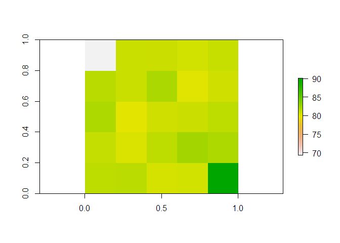

Calculating the Biodiversity Intactness Index: the PREDICTS
implementation
================
Adriana De Palma, Katia Sanchez-Ortiz and Andy Purvis
24 October, 2019

  - [About PREDICTS](#about-predicts)
  - [About BII](#about-bii)
  - [Load some packages](#load-some-packages)
  - [Prepare the biodiversity data](#prepare-the-biodiversity-data)
  - [Calculate diversity indices](#calculate-diversity-indices)
      - [Total Abundance](#total-abundance)
      - [Compositional Similarity](#compositional-similarity)
  - [Run the statistical analysis](#run-the-statistical-analysis)
      - [Total Abundance](#total-abundance-1)
      - [Compositional Similarity](#compositional-similarity-1)
  - [Projecting the model](#projecting-the-model)
      - [Model predictions](#model-predictions)
      - [Gather land-use rasters](#gather-land-use-rasters)
      - [Spatial projections of BII](#spatial-projections-of-bii)
  - [Extensions](#extensions)
      - [Validation](#validation)
  - [Advantages](#advantages)
  - [Limitations](#limitations)
      - [Assumptions of PREDICTS](#assumptions-of-predicts)
      - [Uncertainty](#uncertainty)
      - [BII is a valuable metric, but isn’t the only
        answer](#bii-is-a-valuable-metric-but-isnt-the-only-answer)
  - [R Info](#r-info)
  - [Acknowledgements](#acknowledgements)
  - [How to cite](#how-to-cite)

This tutorial gives a step-by-step guide on how to calculate the
Biodiversity Intactness Index (BII) using the PREDICTS database. We’ll
go through where to find the PREDICTS data, how we go about analysing
this data and finally how to project and calculate BII, using `R`. We’ll
be using just a subset of the data and a very simple model to start
with.

# About PREDICTS

<details>

<summary>[PREDICTS](https://www.predicts.org.uk/) – Projecting Responses
of Ecological Diversity In Changing Terrestrial Systems – is a
collaboration that aims to model how local terrestrial biodiversity
worldwide responds to land use and related pressures, and to use such
models to project how biodiversity may change under future socioeconomic
scenarios. *Expand to learn more* </summary>The PREDICTS team have
collated a large database of biodiversity data from over 29,000 sites
worldwide. These data have been provided by authors of over 700 separate
surveys, each of which sampled biodiversity at multiple sites facing
different land-use and related pressures. Although the different surveys
have used a very wide range of different techniques, and focused on a
wide array of different plant, fungal, invertebrate or vertebrate taxa
(the database now holds data from over 50,000 species), the data from
different sites within a survey are comparable, having been collected in
the same way. Each site’s land use and land-use intensity has been
classified into a consistent set of categories, based on information in
the paper or from the authors, and some other human pressures (e.g.,
human population density) are estimated for each site from global
rasters. Details of how the database was put together – including
definitions of our land-use and use-intensity classes – can be found in
[this
paper](https://onlinelibrary.wiley.com/doi/full/10.1002/ece3.1303); the
first released version of the database is available from the [Natural
History Museum’s data portal](https://data.nhm.ac.uk/), and is described
in [this
paper](https://onlinelibrary.wiley.com/doi/full/10.1002/ece3.2579).

Because the database holds the original biodiversity data, statistical
analysis can model a wide range of response variables (as explained in
[this
paper](https://www.sciencedirect.com/science/article/pii/S0065250417300284)),
including site-level measures of diversity (such as [within-sample
species richness, rarefaction-based richness or overall organismal
abundance](https://www.nature.com/articles/nature14324)), [among-site
differences in community
composition](https://onlinelibrary.wiley.com/doi/full/10.1111/ecog.01932),
or [the occurrence and/or population size of each
species](https://besjournals.onlinelibrary.wiley.com/doi/full/10.1111/1365-2664.12524).
Combining our data with other species-level information permits
modelling of [functional and phylogenetic
diversity](https://onlinelibrary.wiley.com/doi/10.1111/ddi.12638) or of
[a community-weighted measure of geographic range
size](https://journals.plos.org/plosbiology/article?id=10.1371/journal.pbio.2006841).
This walkthrough document focuses on modelling two response variables:
total site-level abundance, and compositional similarity between sites.

Because the surveys in the database arise from such very different
methodologies, we fit mixed-effects models with survey-level random
effects, allowing us to focus on how human pressures affect the response
variable while acknowledging the among-survey heterogeneity. We assume
that biotic differences among matched sites with different land uses are
caused by the land-use difference, a form of space-for-time
substitution. Some of our models also assume that the biota at sites
with minimally-used primary vegetation (and minimal levels of other
pressures) approximates their pristine biota. These assumptions would
not be needed if representative long-term temporal data were available.

Models can be fitted to the whole global data or to regions of
particular interest (such as [tropical and subtropical forest
biomes](https://www.biorxiv.org/content/10.1101/311688v3)). The models
can be combined with detailed spatiotemporal data on the pressures [to
map the projected current state of the response
variable](https://onlinelibrary.wiley.com/doi/10.1111/ddi.12638),
[estimate how it has changed in the
past](https://www.biorxiv.org/content/10.1101/311688v3), or [project its
future under alternative
scenarios](https://www.biorxiv.org/content/10.1101/311787v1).

</details>

# About BII

<details>

<summary>The Biodiversity Intactness Index (BII) was initially [proposed
in 2005](https://www.nature.com/articles/nature03289) as a sound,
sensitive, easily understood and affordable biodiversity indicator that
could easily be applied at any spatial scale and would allow for
comparison with a policy target and a baseline. BII is defined as the
average abundance, across a large and functionally diverse set of
species, relative to their reference populations (which would ideally be
populations before any impacts of modern industrial society, but which
practically have to be populations in the least impacted settings
available); non-native species are excluded from the calculation.
*Expand to learn more*</summary>

BII became more prominent with its adoption in the [2015 revision of the
Planetary Boundaries
framework](https://science.sciencemag.org/content/347/6223/1259855) as
an interim measure of biosphere integrity. The framework proposed that
reduction of average BII to below 90% across a large region such as a
biome would risk large-scale disruption of the flow of ecosystem
services and jeopardise sustainable development, though the paper
acknowledged that the precise placement of the ‘safe limit’ for BII was
very uncertain.

In the absence of sufficient collated biodiversity data, BII was
initially [estimated](https://www.nature.com/articles/nature03289) using
carefully-structured expert opinion. The PREDICTS team [first estimated
BII based on primary biodiversity data
in 2016](https://science.sciencemag.org/content/353/6296/288), by
combining two statistical models – one of site-level organismal
abundance, and one of compositional similarity to a site still having
primary vegetation. The latter model was needed to account for the fact
that models of overall organismal abundance do not consider turnover in
species composition. Although we gave several reasons why our estimates
of BII were likely to be overoptimistic, our 2016 estimates nonetheless
placed the world, nearly all biomes and nearly all biodiversity hotspots
below the proposed ‘safe limit’ for BII.

We have [continued to refine the modelling framework to improve our
estimates of BII](https://www.biorxiv.org/content/10.1101/311688v3). The
most important improvements since the 2016 paper have been:

  - Use of a more stringent baseline in models of compositional
    similarity. Whereas the 2016 paper used all primary vegetation sites
    (even those with intense human use) as the baseline land use, growth
    of the database and a switch to a more efficient (matrix-based)
    model framework have allowed us to use only minimally-used primary
    vegetation as the baseline.
  - A more principled transformation of the compositional similarity
    estimates prior to modelling. Although the log-transformation used
    in the 2016 paper produced acceptable model diagnostics, it does not
    recognise the bounded nature of compositional similarity (which can
    range from 0 to 1). We now use a logit transformation instead, which
    provides more sensitive discrimination among land uses.

The estimates of BII that result from the improved framework tend to be
[markedly lower than those we obtained
in 2016](https://www.nature.com/articles/s41559-019-0896-0). One issue
that remains to be addressed is that the land-use rasters we have been
using to make spatial projections do not differentiate planted from
natural forest, meaning our estimates are still likely to be too high in
regions with extensive planted forest. Work to address this shortcoming
is underway.

BII, being an indicator of the average state of local ecological
communities, complements indicators based on species’ global
conservation status (such as the Red List Index), or on population
trends (such as the Living Planet Index). These different facets of
biodiversity are all important, and [can be combined to provide a
roadmap towards restoring global
biodiversity](https://www.nature.com/articles/s41893-018-0130-0).

</details>

# Load some packages

``` r
library(dplyr) # for easy data manipulation
library(tidyr) # ditto
library(magrittr) # for piping
library(lme4) # for mixed effects models
library(car) # for logit transformation with adjustment
library(raster) # for working with raster data
library(geosphere) # calculating geographic distance between sites
library(foreach) # running loops
library(doParallel) # running loops in parallel
```

# Prepare the biodiversity data

You can download the PREDICTS data from the
<a href="http://data.nhm.ac.uk/dataset/the-2016-release-of-the-predicts-database" target="_blank">Natural
History Museum data portal<a/>. If you’re working in `R`, I would
strongly suggest downloading `database.rds` (the database is very large,
and the rds file is much quicker to load in than the csv file).

Once you’ve downloaded the database, read it in. I’m going to filter the
data for just the Americas, to make the data manipulation and modelling
a bit quicker. You can calculate BII for *any* region of the world for
which there are data, although we tend to do our BII modelling on a
global scale or at least across multiple biomes.

``` r
# read in the data
diversity <- readRDS("database.rds") %>%
  
  # now let's filter out just the data for the Americas
  filter(UN_region == "Americas")

glimpse(diversity)
```

    ## Observations: 825,682
    ## Variables: 67
    ## $ Source_ID                               <fct> AD1_2005__Shuler, AD1_...
    ## $ Reference                               <fct> Shuler et al. 2005, Sh...
    ## $ Study_number                            <int> 1, 1, 1, 1, 1, 1, 1, 1...
    ## $ Study_name                              <fct> Shuler2005_flowervisit...
    ## $ SS                                      <fct> AD1_2005__Shuler 1, AD...
    ## $ Diversity_metric                        <fct> effort-corrected abund...
    ## $ Diversity_metric_unit                   <fct> effort-corrected indiv...
    ## $ Diversity_metric_type                   <fct> Abundance, Abundance, ...
    ## $ Diversity_metric_is_effort_sensitive    <lgl> FALSE, FALSE, FALSE, F...
    ## $ Diversity_metric_is_suitable_for_Chao   <lgl> FALSE, FALSE, FALSE, F...
    ## $ Sampling_method                         <fct> systematic searching, ...
    ## $ Sampling_effort_unit                    <fct> day, day, day, day, da...
    ## $ Study_common_taxon                      <fct> Hymenoptera, Hymenopte...
    ## $ Rank_of_study_common_taxon              <fct> Order, Order, Order, O...
    ## $ Site_number                             <int> 1, 1, 1, 1, 1, 2, 2, 2...
    ## $ Site_name                               <fct> Ayrshire Farms, Ayrshi...
    ## $ Block                                   <fct> , , , , , , , , , , , ...
    ## $ SSS                                     <fct> AD1_2005__Shuler 1 1, ...
    ## $ SSB                                     <fct> AD1_2005__Shuler 1 , A...
    ## $ SSBS                                    <fct> AD1_2005__Shuler 1  1,...
    ## $ Sample_start_earliest                   <date> 2003-07-07, 2003-07-0...
    ## $ Sample_end_latest                       <date> 2003-08-05, 2003-08-0...
    ## $ Sample_midpoint                         <date> 2003-07-21, 2003-07-2...
    ## $ Sample_date_resolution                  <fct> day, day, day, day, da...
    ## $ Max_linear_extent_metres                <dbl> 2844.9464, 2844.9464, ...
    ## $ Habitat_patch_area_square_metres        <dbl> 4046856.4, 4046856.4, ...
    ## $ Sampling_effort                         <dbl> 1, 1, 1, 1, 1, 1, 1, 1...
    ## $ Rescaled_sampling_effort                <dbl> 1, 1, 1, 1, 1, 1, 1, 1...
    ## $ Habitat_as_described                    <fct> Squash or pumpkin farm...
    ## $ Predominant_land_use                    <fct> Cropland, Cropland, Cr...
    ## $ Source_for_predominant_land_use         <fct> Direct from publicatio...
    ## $ Use_intensity                           <fct> Light use, Light use, ...
    ## $ Km_to_nearest_edge_of_habitat           <dbl> NA, NA, NA, NA, NA, NA...
    ## $ Years_since_fragmentation_or_conversion <dbl> NA, NA, NA, NA, NA, NA...
    ## $ Transect_details                        <fct> , , , , , , , , , , , ...
    ## $ Coordinates_method                      <fct> Direct from publicatio...
    ## $ Longitude                               <dbl> -77.86848, -77.86848, ...
    ## $ Latitude                                <dbl> 38.95733, 38.95733, 38...
    ## $ Country_distance_metres                 <dbl> 0, 0, 0, 0, 0, 0, 0, 0...
    ## $ Country                                 <fct> United States, United ...
    ## $ UN_subregion                            <fct> North America, North A...
    ## $ UN_region                               <fct> Americas, Americas, Am...
    ## $ Ecoregion_distance_metres               <dbl> 0, 0, 0, 0, 0, 0, 0, 0...
    ## $ Ecoregion                               <fct> Piedmont, Piedmont, Pi...
    ## $ Biome                                   <fct> Temperate Broadleaf & ...
    ## $ Realm                                   <fct> Nearctic, Nearctic, Ne...
    ## $ Hotspot                                 <fct> , , , , , , , , , , , ...
    ## $ Wilderness_area                         <fct> , , , , , , , , , , , ...
    ## $ Taxon_number                            <int> 1, 2, 3, 4, 5, 1, 2, 3...
    ## $ Taxon_name_entered                      <fct> Apis mellifera, Pepona...
    ## $ Indication                              <fct> Hymenoptera: Apidae se...
    ## $ Parsed_name                             <fct> Apis mellifera, Pepona...
    ## $ Taxon                                   <fct> Apis mellifera, Pepona...
    ## $ COL_ID                                  <int> 6845885, 6927991, 1302...
    ## $ Name_status                             <fct> accepted name, accepte...
    ## $ Rank                                    <fct> Species, Species, Fami...
    ## $ Kingdom                                 <fct> Animalia, Animalia, An...
    ## $ Phylum                                  <fct> Arthropoda, Arthropoda...
    ## $ Class                                   <fct> Insecta, Insecta, Inse...
    ## $ Order                                   <fct> Hymenoptera, Hymenopte...
    ## $ Family                                  <fct> Apidae, Apidae, Halict...
    ## $ Genus                                   <fct> Apis, Peponapis, , Mel...
    ## $ Species                                 <fct> mellifera, pruinosa, ,...
    ## $ Best_guess_binomial                     <fct> Apis mellifera, Pepona...
    ## $ Higher_taxon                            <fct> Hymenoptera, Hymenopte...
    ## $ Measurement                             <dbl> 0.00, 0.75, 0.00, 0.00...
    ## $ Effort_corrected_measurement            <dbl> 0.00, 0.75, 0.00, 0.00...

[This paper](https://onlinelibrary.wiley.com/doi/full/10.1002/ece3.1303)
describes the PREDICTS database structure and content. Briefly, the
database consists of a number of different sources (journal articles),
`Source_ID` in the database, within which there can be multiple studies
(`Study_name` and `Study_number`). Within each study, there are multiple
sites (`Site_name` and `Site_number`) within blocks (`Block`). For ease,
we use the combined, shorthand values for these: `SS` (`Study_number`
and `Source_ID`), `SSB` (`SS` and `Block`) and `SSBS` (`SSB`
and`Site_number`).

Now let’s explore the data a little.

``` r
table(diversity$Predominant_land_use, diversity$Use_intensity)
```

    ##                                           
    ##                                            Minimal use Light use
    ##   Primary vegetation                            163302     73282
    ##   Young secondary vegetation                     36731      9427
    ##   Intermediate secondary vegetation              51349     12968
    ##   Mature secondary vegetation                    39909      5936
    ##   Secondary vegetation (indeterminate age)       44260     10349
    ##   Plantation forest                               9046     18478
    ##   Pasture                                        38321     93577
    ##   Cropland                                       13184     37887
    ##   Urban                                           7431      5547
    ##   Cannot decide                                      0         0
    ##                                           
    ##                                            Intense use Cannot decide
    ##   Primary vegetation                             22783         12828
    ##   Young secondary vegetation                      3673          7467
    ##   Intermediate secondary vegetation               1041          5135
    ##   Mature secondary vegetation                      396          2814
    ##   Secondary vegetation (indeterminate age)         373          5407
    ##   Plantation forest                               9429          2985
    ##   Pasture                                         2612         29274
    ##   Cropland                                       18751         24188
    ##   Urban                                           1772           332
    ##   Cannot decide                                      0          3438

There’s lots of data for the Americas across all land-use and intensity
classes. Since we’re using a simplified model for illustration purposes,
we’re not going to look at *all* the use intensities here. However, we
will keep *minimally-used primary vegetation* separate, as this is the
closest we have to a *pristine* baseline.

So let’s collapse down the data. Note that I’m doing this purely to make
the example simpler. In reality, we include multiple land use and
intensity combinations, including the age class of secondary vegetation
when possible.

``` r
diversity <- diversity %>%
  # make a level of Primary minimal. Everything else gets the coarse land use
  mutate(
    LandUse = ifelse(Predominant_land_use == "Primary vegetation" & Use_intensity == "Minimal use",
                     "Primary minimal",
                     paste(Predominant_land_use)),
    
    # collapse the secondary vegetation classes together
    LandUse = ifelse(grepl("secondary", tolower(LandUse)),
                     "Secondary vegetation",
                     paste(LandUse)),
    
    # change cannot decide into NA
    LandUse = ifelse(Predominant_land_use == "Cannot decide",
                     NA, 
                     paste(LandUse)),
    
    # relevel the factor so that Primary minimal is the first level (so that it is the intercept term in models)
    LandUse = factor(LandUse),
    LandUse = relevel(LandUse, ref = "Primary minimal")
  )
```

# Calculate diversity indices

The Biodiversity Intactness Index is derived from combining two models:
one of total abundance, and one of compositional similarity. We’re going
to calculate these diversity metrics now.

## Total Abundance

Total abundance is simply the sum of all individuals sampled at each
site.

``` r
abundance_data <- diversity %>%
  
  # pull out just the abundance measures
  filter(Diversity_metric_type == "Abundance") %>%
  
  # group by SSBS (each unique value corresponds to a unique site)
  group_by(SSBS) %>%
  
  # now add up all the abundance measurements within each site
  mutate(TotalAbundance = sum(Effort_corrected_measurement)) %>%
  
  # ungroup
  ungroup() %>%
  
  # pull out unique sites
  distinct(SSBS, .keep_all = TRUE) %>%
  
  # now group by Study ID
  group_by(SS) %>%
  
  # pull out the maximum abundance for each study
  mutate(MaxAbundance = max(TotalAbundance)) %>%
  
  # ungroup
  ungroup() %>%
  
  # now rescale total abundance, so that within each study, abundance varies from 0 to 1.
  mutate(RescaledAbundance = TotalAbundance/MaxAbundance)
```

Note that here we are using the `Effort_corrected_measurement`. For some
studies, the sampling effort (but not the method) can vary slightly
among sites. To account for this, we assume that abundance increases
linearly with sampling effort (validated
[here](https://www.nature.com/articles/srep31153)) – i.e., the abundance
measurement is divided by the sampling effort so that it is transformed
to abundance per unit effort. This is ok for modelling total abundance,
but we can’t account for how the *identity* or *number* of species
varies with sampling effort in the same simple way. So in the next stage
where species identity matters, you’ll see that we’re using the
`Measurement` field (raw reported abundance), and will only use studies
where the sampling effort does not vary among sites.

## Compositional Similarity

We use the *asymmetric Jaccard Index* as our measure of compositional
similarity. Essentially, we want to know what species are present in our
baseline sites (`Primary minimal`), and then for our converted sites
(all other land uses), what proportion of individuals come from species
that are also found in the baseline site.

As an example, let’s look at the following simple scenario. Our primary
minimal site had 15 *Species A* individuals and 30 *Species B*
individuals. A cropland site has 10 *Species A* and 40 *Species C*
individuals. The compositional similarity measure that we use currently
would say that only 10 out of a total 50 individuals in the cropland
site were from *originally present species* (i.e. *Species A*): a value
of 0.2.

Now, for every study with a `Primary minimal` site, we want to calculate
this compositional similarity measure against every other site in the
study. Note that this has to be done *within* studies: it would be
pointless to compare similarity between a site from a study of birds
with a site from a study of bees.

Let’s first set up the data we’re going to use for the compositional
similarity models.

``` r
cd_data_input <- diversity %>%
  
  # drop any rows with unknown LandUse
  filter(!is.na(LandUse)) %>%
  
  # pull out only the abundance data
  filter(Diversity_metric_type == "Abundance") %>%
  
  # group by Study
  group_by(SS) %>%
  
  # calculate the number of unique sampling efforts within that study
  mutate(n_sample_effort = n_distinct(Sampling_effort)) %>%
  
  # calculate the number of unique species sampled in that study
  mutate(n_species = n_distinct(Taxon_name_entered)) %>%
  
  # check if there are any Primary minimal sites in the dataset
  mutate(n_primin_records = sum(LandUse == "Primary minimal")) %>%
  
  # ungroup
  ungroup() %>%
  
  # now keep only the studies with one unique sampling effort
  filter(n_sample_effort == 1) %>%
  
  # and keep only studies with more than one species 
  # as these studies clearly aren't looking at assemblage-level diversity
  filter(n_species > 1) %>%
  
  # and keep only studies with at least some Primary minimal data
  filter(n_primin_records > 0) %>%
  
  # drop empty factor levels
  droplevels()
```

Now we’ll set up a function to calculate compositional similarity
between a single pair of sites in a study.

``` r
getJacAbSym <- function(s1, s2, data){

  # get the list of species that are present in site 1 (i.e., their abundance was greater than 0)
  s1species <- data %>%
    
    # filter out the SSBS that matches s1
    filter(SSBS == s1) %>%
    
    # filter out the species where the Measurement (abundance) is greater than 0
    filter(Measurement > 0) %>%
    
    # get the unique species from this dataset
    distinct(Taxon_name_entered) %>%
    
    # pull out the column into a vector
    pull
  
  # for site 2, get the total abundance of species that are also present in site 1
  
  s2abundance_s1species <- data %>%
    
    # filter out the SSBS that matches s2
    filter(SSBS == s2) %>%
    
    # filter out the species that are also present in site 1
    filter(Taxon_name_entered %in% s1species) %>%
    
    # pull out the Measurement into a vector
    pull(Measurement) %>%
    
    # calculate the sum
    sum()
  
  # calculate the total abundance of all species in site 2
  s2_sum <- data %>%
    
    # filter out the SSBS that matches s2
    filter(SSBS == s2) %>%
    
    # pull out the measurement column (the abundance)
    pull(Measurement) %>%
    
    # calculate the sum
    sum() 
  
  
  # Now calculate the compositional similarity
  # this is the number of individuals of species also found in s1, divided by the total abundance in s2 
  # so that equates to the proportion of individuals in s2 that are of species also found in s1
  
  sor <- s2abundance_s1species / s2_sum

  
  # if there are no taxa in common, then sor = 0
  # if abundances of all taxa are zero, then similarity becomes NaN.
  return(sor)
  
  }
```

Now that we’ve set up all the functions to gather the data for the
compositional similarity models, let’s get the dataset. We’ll first get
together a vector of all the study IDs that we need to perform the
calculations for.

``` r
# get a vector of each study to loop over
studies <- distinct(cd_data_input, SS) %>%
  pull()
```

Now we have to loop over each element in `studies` and calculate:

1.  the compositional similarity between each pair of sites
2.  the geographic distance between each pair of sites
3.  the land uses for each pair of sites

I’m going to do this in parallel, as we’re looping over a lot of
studies.

``` r
registerDoParallel(cores = 2)

# If you're not familiar with loops (or with foreach loops):
# I'm going to loop over every element (s) in studies and combine the results of each loop by rbinding them into one large dataset. Since we're using functions from different packages within this loop, we need to specify them (if you don't do the loop in parallel, this isn't necessary)
cd_data <- foreach(s = studies, 
                   .combine = rbind,
                   .packages = c("dplyr", "magrittr", "geosphere")) %dopar% {
  
  # filter out the given study
  data_ss <- filter(cd_data_input, SS == s)
  
  # pull out the SSBS and LandUse information (we'll use this later to assign a land use contrast to each pair of site
  site_data <- data_ss %>%
    dplyr::select(SSBS, LandUse) %>%
    distinct(SSBS, .keep_all = TRUE)
  
  # pull out the sites that are Primary minimal (we only want to use comparisons with the baseline)
  baseline_sites <- site_data %>%
    filter(LandUse == "Primary minimal") %>%
    pull(SSBS)
  
  # pull out all the sites
  site_list <- site_data %>%
    pull(SSBS)
  

  # get all site x site comparisons for this study
  site_comparisons <- expand.grid(baseline_sites, site_list) %>%
    
    # rename the columns so they will be what the compositional similarity function expects for ease
    rename(s1 = Var1, s2 = Var2) %>%
    
    # remove the comparisons where the same site is being compared to itself
    filter(s1 != s2)
    
  
  # apply the compositional similarity function over each site combination in the dataset
  sor <- apply(site_comparisons, 1, function(y) getJacAbSym(data = data_ss, s1 = y['s1'], s2 = y['s2']))
  
  # calculate the geographic distance between sites
  # first pull out the lat and longs for each site combination
  s1LatLong <- as.matrix(data_ss[match(site_comparisons$s1, data_ss$SSBS), c('Longitude','Latitude')])
  s2LatLong <- as.matrix(data_ss[match(site_comparisons$s2, data_ss$SSBS), c('Longitude','Latitude')])

  # then calculate the distance between sites
  dist <- distHaversine(s1LatLong, s2LatLong)

  # pull out the land-use contrast for those site combinations
  Contrast <- paste(site_data$LandUse[match(site_comparisons$s1, site_data$SSBS)],
                    site_data$LandUse[match(site_comparisons$s2, site_data$SSBS)], 
                    sep = "-")
  
  # put all the information into a single dataframe
  
  study_results <- data.frame(site_comparisons,
                              sor,
                              dist,
                              Contrast,
                              SS = s,
                              stringsAsFactors = TRUE)

  
  
}

# stop running things in parallel
registerDoSEQ()
```

# Run the statistical analysis

In the PREDICTS database, most of the variation in diversity is going to
be between Studies – each study looks at different species groups in
different areas using different sampling methods. This has to be
accounted for in the statistical analysis. We do this in a mixed effects
framework: we treat studies and blocks as random effects.

## Total Abundance

Let’s start with a simple model of total abundance. Note that the errors
in models of ecological abundance are generally non-normal. Usually, we
would deal with that by modelling abundance with an error structure,
such as poisson or quasipoisson. However, in the PREDICTS database, we
take quite a broad view of what counts as an ‘abundance’ measurement –
they are not all whole individuals so they aren’t whole numbers (e.g.,
they might be expressed as average numbers per square metre). The `lme4`
package doesn’t really like you using a discrete error structure with
continuous data. So instead, we must transform the data. Generally, a
log-transformation does well, but in some cases, a square-root
transformation helps to normalise the errors. *I’m not going to go
through model checking with you here – this is all just to give you an
idea of how to model BII, not how to do statistical analysis… Please
check your residual plots etc before using models to make inferences and
spatial projections\!*

``` r
# run a simple model
ab_m <- lmer(sqrt(RescaledAbundance) ~ LandUse + (1|SS) + (1|SSB), data = abundance_data)
summary(ab_m)
```

    ## Linear mixed model fit by REML ['lmerMod']
    ## Formula: sqrt(RescaledAbundance) ~ LandUse + (1 | SS) + (1 | SSB)
    ##    Data: abundance_data
    ## 
    ## REML criterion at convergence: -3150.3
    ## 
    ## Scaled residuals: 
    ##     Min      1Q  Median      3Q     Max 
    ## -3.6754 -0.5860 -0.0550  0.5641  4.4054 
    ## 
    ## Random effects:
    ##  Groups   Name        Variance Std.Dev.
    ##  SSB      (Intercept) 0.006043 0.07774 
    ##  SS       (Intercept) 0.025521 0.15975 
    ##  Residual             0.033383 0.18271 
    ## Number of obs: 7009, groups:  SSB, 467; SS, 216
    ## 
    ## Fixed effects:
    ##                              Estimate Std. Error t value
    ## (Intercept)                  0.651260   0.013964  46.637
    ## LandUseCropland             -0.016003   0.012746  -1.256
    ## LandUsePasture              -0.013464   0.009998  -1.347
    ## LandUsePlantation forest    -0.054914   0.013446  -4.084
    ## LandUsePrimary vegetation   -0.022285   0.009904  -2.250
    ## LandUseSecondary vegetation  0.034908   0.009004   3.877
    ## LandUseUrban                -0.066293   0.020714  -3.200
    ## 
    ## Correlation of Fixed Effects:
    ##             (Intr) LndUsC LndUsP LndUPf LndUPv LndUSv
    ## LndUsCrplnd -0.259                                   
    ## LandUsePstr -0.284  0.492                            
    ## LndUsPlnttf -0.268  0.232  0.294                     
    ## LndUsPrmryv -0.283  0.328  0.411  0.332              
    ## LndUsScndrv -0.367  0.422  0.527  0.380  0.510       
    ## LandUseUrbn -0.164  0.193  0.205  0.141  0.270  0.250

The model shows that all land uses except for secondary vegetation have
lower total abundance than the baseline (minimally-used primary
vegetation), some of them significantly so. We’ve just run a very simple
model here, but you can add in additional human pressures (e.g., human
population density).

## Compositional Similarity

Now let’s do a model of compositional similarity. For compositional
similarity models, we include a measure of the geographic distance
beween sites. This allows us to discount *natural* turnover in species
with distance. You can also include environmental distance (we’ve done
this previously based on Gower’s dissimilarity of climatic variables)
and additional human pressures in models like this.

The compositional similarity measure we use is bounded between 0 and 1 –
this means the errors will probably not be normally distributed.
Although log-transformation produced models with acceptable diagnostics,
it doesn’t respect the boundedness of the compositional similarity
measure. We’ve found that a logit transformation (with an adjustment to
account for 0s and 1s), which does recognise the boundedness, also gives
acceptable diagnostics.

``` r
# there is some data manipulation we want to do before modelling
cd_data <- cd_data %>%
  
  # Firstly, we only care about comparisons where Primary minimal is the first site
  # so pull the contrast apart
  separate(Contrast, c("s1_LandUse", "s2_LandUse"), sep = "-", remove = FALSE) %>%
  
  # filter sites where s1_LandUse is the baseline site
  filter(s1_LandUse == "Primary minimal") %>%
  
  # logit transform the compositional similarity
  mutate(logitCS = logit(sor, adjust = 0.001, percents = FALSE)) %>%
  
  # log10 transform the geographic distance between sites
  mutate(log10geo = log10(dist + 1)) %>%
  
  # make primary minimal-primary minimal the baseline again
  mutate(Contrast = factor(Contrast), 
         Contrast = relevel(Contrast, ref = "Primary minimal-Primary minimal"))


# Model compositional similarity as a function of the land-use contrast and the geographic distance between sites
cd_m <- lmer(logitCS ~ Contrast + log10geo + (1|SS), data = cd_data)
summary(cd_m)
```

    ## Linear mixed model fit by REML ['lmerMod']
    ## Formula: logitCS ~ Contrast + log10geo + (1 | SS)
    ##    Data: cd_data
    ## 
    ## REML criterion at convergence: 757398.2
    ## 
    ## Scaled residuals: 
    ##     Min      1Q  Median      3Q     Max 
    ## -2.9033 -0.7263  0.0671  0.5304  3.7308 
    ## 
    ## Random effects:
    ##  Groups   Name        Variance Std.Dev.
    ##  SS       (Intercept) 6.469    2.544   
    ##  Residual             9.423    3.070   
    ## Number of obs: 148985, groups:  SS, 95
    ## 
    ## Fixed effects:
    ##                                              Estimate Std. Error t value
    ## (Intercept)                                   2.33360    0.28152   8.289
    ## ContrastPrimary minimal-Primary vegetation   -0.32459    0.03191 -10.171
    ## ContrastPrimary minimal-Urban                -1.66278    0.04343 -38.285
    ## ContrastPrimary minimal-Pasture              -1.90225    0.03146 -60.468
    ## ContrastPrimary minimal-Secondary vegetation  0.10686    0.03659   2.920
    ## ContrastPrimary minimal-Plantation forest    -0.45909    0.07290  -6.297
    ## ContrastPrimary minimal-Cropland             -1.20430    0.04511 -26.699
    ## log10geo                                     -0.28403    0.01069 -26.563
    ## 
    ## Correlation of Fixed Effects:
    ##             (Intr) CPm-Pv CnPm-U CnPm-P CPm-Sv CPm-Pf CnPm-C
    ## CntrstPm-Pv -0.026                                          
    ## CntrstPmn-U -0.005  0.285                                   
    ## CntrstPmn-P -0.022  0.296  0.164                            
    ## CntrstPm-Sv -0.043  0.238  0.120  0.286                     
    ## CntrstPm-Pf -0.038  0.172  0.109  0.118  0.165              
    ## CntrstPmn-C -0.016  0.213  0.237  0.147  0.222  0.091       
    ## log10geo    -0.138 -0.046 -0.103 -0.056 -0.035 -0.012 -0.037

Note that you can’t trust the significance values of these compositional
similarity values. The same site goes into multiple comparisons in the
model (each Primary minimal site is compared to all other sites in the
study), which will inflate the p-values. If you want to look at
significance values, you’ll need to use permutation tests in order to
see which effects are significant. We’re not going to do that here
because they can take a while.

# Projecting the model

Now we have one model (`ab_m`) telling us how land-use change influences
the total abundance of species and one model (`cs_m`) that tells us what
proportion of those individuals are from ‘originally present species’ in
a community. Multiplying these together gives us the BII: the abundance
of originally present species. We do this by projecting abundance and
compositional similarity onto rasters of pressure data, and then
multiplying the two output maps together.

## Model predictions

First of all, let’s use the models to predict the abundance and
compositional similarity in each land-use class, ignoring the impact of
random effects (see `help(predict.merMod)` for more details on this).

``` r
# let's start with the abundance model

# set up a dataframe with all the levels you want to predict diversity for
# so all the land-use classes in your model must be in here
newdata_ab <- data.frame(LandUse = levels(abundance_data$LandUse)) %>%
  
  # now calculate the predicted diversity for each of these land-use levels
  # setting re.form = NA means random effect variance is ignored
  # then square the predictions (because we modelled the square root of abundance, so we have to back-transform it to get the real predicted values)
  mutate(ab_m_preds = predict(ab_m, ., re.form = NA) ^ 2)


# now the compositional similarity model

# set up a function to calculate the inverse logit of the adjusted logit function we used
# where f is the value to be back-transformed and a is the adjustment value used for the transformation
inv_logit <- function(f, a){
  a <- (1-2*a)
  (a*(1+exp(f))+(exp(f)-1))/(2*a*(1+exp(f)))
}

# once again, set up the dataframe with all the levels you want to predict diversity for
# because we had an extra fixed effect in this model (log10geo), we also have to set a baseline level for this
# we'll set it to 0 because we're interested in the compositional similarity when distance between sites is 0 (i.e., when distance-based turnover is discounted, what is the turnover because of land use?)
newdata_cd <- data.frame(Contrast = levels(cd_data$Contrast),
                      log10geo = 0) %>%
  mutate(cd_m_preds = predict(cd_m, ., re.form = NA) %>%
           inv_logit(a = 0.001))
```

It’s these *predicted* values (`ab_m_preds` and `cd_m_preds`) that we’re
going to use. We will multiply the predicted abundance and compositional
similarity in each land-use class with the area of the cell in that
land-use class. However, because we have a mixed effects model, the
*absolute* values are somewhat meaningless. Instead, we care about the
*relative* values – what is the abundance or compositional similarity
*relative* to what we’d find if the whole landscape was still
minimally-used primary vegetation. So once we have the predictions, we
divide by the reference value (the predicted abundance or compositional
similarity if the whole cell was minimally-used primary vegetation).

## Gather land-use rasters

You can use any land-use data you like, but many land-use maps don’t
have classes that map easily onto the definitions used by PREDICTS.
Notable exceptions are land-use maps developed for the Representative
Concentration Pathways
(<a href="http://luh.umd.edu/data.shtml#LUH1_Data" target="_blank">LUH1<a/>),
because PREDICTS land-use classes were designed with these maps in mind,
and the derived fine-resolution product developed by
<a href="https://data.csiro.au/dap/landingpage?pid=csiro:15276&v=3&d=true" target="_blank">CSIRO<a/>.

I’m just going to simulate some rasters here for ease.

We’ve got seven land-use classes. Imagine we have seven rasters, one for
each land-use class, and the cell value is the proportion of the cell
assigned to that land-use class. We’ll generate some random numbers for
each of the land uses – let’s make it mostly cropland, with a fair chunk
of pasture and secondary vegetation, with just patches of natural land
and urban
areas.

``` r
# generate a dataframe with random numbers for the cell values for each land-use class
lus <- data.frame(pri_min = rnorm(25, mean = 50, sd = 25),
                  pri = rnorm(25, mean = 100, sd = 25),
                  plant = rnorm(25, mean = 100, sd = 25),
                  sec = rnorm(25, mean = 300, sd = 25),
                  crop = rnorm(25, mean = 1000, sd = 25),
                  pas = rnorm(25, mean = 400, sd = 25),
                  urb = rnorm(25, mean = 50, sd = 25)
                  )

# let's artificially make the first cell dominated by urban land and the last cell dominated by minimally-used primary vegetation
lus$urb[1] <- 2000
lus$pri_min[25] <- 2000

lus <- lus %>%
  # calculate the row totals
  mutate(tot = rowSums(.)) %>%
  
  # now, for each land use, divide the value by the rowsum
  # this will give us the proportion of each land use in each cell
  transmute_at(1:7, list(~ ./tot))

# double check that the proportions of each land use sum to 1 (accounting for rounding errors)
all(zapsmall(rowSums(lus)) == 1)
```

    ## [1] TRUE

Now turn each land use into its own 5 \(\times\) 5 raster.

``` r
# for each column of lus (i.e., each land use)
for(i in 1:ncol(lus)){
  
  # take the column and turn it into a 5 x 5 matrix
  ras <- matrix(lus[ , i], nrow = 5, ncol = 5) %>%
    # turn that into a raster
    raster()
  
  # come up with a name for the object to hold that raster
  nm <- paste(names(lus)[i], "raster", sep = "_")
  
  # and assign the raser to that name
  assign(x = nm, value = ras)
  
}
```

For example, here’s the raster showing the amount of urban land in each
cell:

``` r
plot(urb_raster)
```

<!-- -->

## Spatial projections of BII

Calculate the output rasters for abundance (`ab_raster`) and
compositional similarity (`cd_raster`) by multiplying the predictions
for each land-use class by the amount of that land-use class in the
cell.

``` r
ab_raster <- (newdata_ab$ab_m_preds[newdata_ab$LandUse == 'Primary minimal'] * pri_min_raster + 
  newdata_ab$ab_m_preds[newdata_ab$LandUse == 'Primary vegetation'] * pri_raster + 
  newdata_ab$ab_m_preds[newdata_ab$LandUse == 'Plantation forest'] * plant_raster +
  newdata_ab$ab_m_preds[newdata_ab$LandUse == 'Secondary vegetation'] * sec_raster +
  newdata_ab$ab_m_preds[newdata_ab$LandUse == 'Cropland'] * crop_raster +
  newdata_ab$ab_m_preds[newdata_ab$LandUse == 'Pasture'] * pas_raster +
  newdata_ab$ab_m_preds[newdata_ab$LandUse == 'Urban'] * urb_raster) /
  
  # divide by the reference value
  newdata_ab$ab_m_preds[newdata_ab$LandUse == 'Primary minimal']


cd_raster <- (newdata_cd$cd_m_preds[newdata_cd$Contrast == 'Primary minimal-Primary minimal'] * pri_min_raster + 
  newdata_cd$cd_m_preds[newdata_cd$Contrast == 'Primary minimal-Primary vegetation'] * pri_raster + 
  newdata_cd$cd_m_preds[newdata_cd$Contrast == 'Primary minimal-Plantation forest'] * plant_raster + 
  newdata_cd$cd_m_preds[newdata_cd$Contrast == 'Primary minimal-Secondary vegetation'] * sec_raster +
  newdata_cd$cd_m_preds[newdata_cd$Contrast == 'Primary minimal-Cropland'] * crop_raster +
  newdata_cd$cd_m_preds[newdata_cd$Contrast == 'Primary minimal-Pasture'] * pas_raster +
  newdata_cd$cd_m_preds[newdata_cd$Contrast == 'Primary minimal-Urban'] * urb_raster) /
  
  # divide by the reference value
  newdata_cd$cd_m_preds[newdata_cd$Contrast == 'Primary minimal-Primary minimal']
```

The final step is to multiply the abundance and compositional similarity
rasters together. We’ll also multiply the values by 100 so that BII is
expressed as a percentage rather than a proportion.

``` r
bii <- ab_raster * cd_raster
plot(bii * 100)
```

<!-- -->

Once you have your map of BII, you can calculate the average value
across any spatial scale. The average BII across this map is 80.89.

And that is it. A quick walkthrough of how we use the PREDICTS database
to model and project the Biodiversity Intactness Index.

# Extensions

  - The model framework is pretty flexible, so you can incorporate
    additional human pressures (like human population density and road
    density) into the statistical models of both abundance and
    compositional similarity.
  - If you’d like to *weight* your maps of BII, you can also multiply
    the outputs by additional layers, such as NPP, to give more weight
    to naturally more productive or more diverse areas.
  - If you have pressure data across time as well as space, you can look
    at temporal changes in BII (assuming that responses to pressures are
    the same across these time periods).

## Validation

Four approaches have been used to validate PREDICTS’ models and
estimates of BII.

1.  Jack-knifing has been used to assess whether any parameter estimates
    are unduly sensitive to particular individual studies (e.g. [this
    paper](https://onlinelibrary.wiley.com/doi/full/10.1111/ddi.12478)).
2.  Cross-validation has been used to assess the robustness of parameter
    estimates. For example, [this
    paper](https://www.nature.com/articles/nature14324) fitted models
    leaving out each biome in turn, ensuring that the global model was
    not driven by extreme estimates for any particular biome.
3.  We have tested whether model parameters differ significantly among
    regions or taxonomic groups by testing for region \(\times\)
    pressure or group \(\times\) pressure interactions, e.g., [this
    paper](https://www.nature.com/articles/srep31153) and [this
    paper](https://link.springer.com/article/10.1007/s10531-017-1356-2).
4.  [One
    paper](https://zslpublications.onlinelibrary.wiley.com/doi/full/10.1111/acv.12327)
    collected field data on birds at sites in Tanzania and Kenya, and
    compared an Africa-wide PREDICTS biodiversity model with a bird
    model based on the independent field data.

A key assumption of our method for calculating BII is that species in
minimally-used primary vegetation are *native* species. This is not
always true, but we can’t always identify which species are native or
alien in the PREDICTS database. For island communities where we can
distinguish native species from alien species, we are working to compare
BII as calculated above (with an abundance model and compositional
similarity model) with BII modeled as the abundance of native species
only (with an abundance model of *only* native species).

# Advantages

  - BII is empirically derived from a transparent database.
  - BII has been proposed as an indicator useful in assessing whether we
    have transgressed Planetary Boundaries.
  - Because BII is an indicator of local biodiversity, you can simply
    average it across all the pixels in a region to get a summary of the
    average state of local biodiversity for that region.

# Limitations

## Assumptions of PREDICTS

There are some inherent assumptions in PREDICTS that we’ve mentioned
previously both in this document and in our papers. Firstly, we assume
that differences in biodiversity among matched sites with different land
uses are caused by the land-use difference. This is a form of
space-for-time substitution. In reality, it can take centuries for the
full impact of a land-use change to be seen in the ecological community;
in the models we’ve shown you above, we’ve assumed that the sites are at
their ‘equilibrium’ level of biodiversity so the full impact of land-use
change has already been felt. This won’t always be true. For secondary
vegetation sites, we can at least *try* to account for this by including
the broad ages of secondary vegetation. Ideally, we would use
time-series data to model biodiversity changes in response to land-use
change, but such surveys also have their own limitations that would
likely limit our ability to produce global models underpinned by
geographically and taxonomically representative data ([see
here](https://www.sciencedirect.com/science/article/pii/S0065250417300296)
for a discussion of different data types and their advantages and
limitations). However, we’ve been working on a database and modelling
framework to attempt to validate our assumptions.

Secondly, the models presented in this walkthrough assume that the biota
at sites with minimally-used primary vegetation approximates their
pristine biota, when in reality, truly intact land is rare. It is likely
that many of the primary vegetations sites (even those that are
minimally used) will have had species filtered out by past disturbances
or will have experienced compositional changes due to disturbances in
the surrounding areas. We can try to account for additional pressures
affecting sites by including more variables in the models (e.g., human
population density and distance to the nearest road or road density).
However, we do not have *true* baseline sites with which we can make
biodiversity comparisons, because we don’t have representative long-term
data.

## Uncertainty

Hopefully it goes without saying, but the uncertainty in the BII map
will depend on its inputs, both in terms of the statistical models and
the geospatial data used for projections. The higher the uncertainty in
these aspects, the higher the uncertainty in the BII projections.
Although land-use mapping is continually advancing, there are still
limitations. So using a global map and then drilling down into a single
pixel is not really advisable. Instead, the maps are more likely to be
reliable when looking over broader areas and larger time steps, rather
than pixel by pixel and year by year.

## BII is a valuable metric, but isn’t the only answer

BII is a measure of ecosystem intactness, but we do not expect it to be
used in isolation. There are myriad biodiversity metrics and indices out
there, and which one you use will depend on what is most
important/interesting/relevant to you and your system. [BII is just one
metric, but can complement
others](https://www.nature.com/articles/s41893-018-0130-0), such as
indicators based on extinction risk and population decline.

# R Info

``` r
utils::sessionInfo()
```

    ## R version 3.6.1 (2019-07-05)
    ## Platform: x86_64-w64-mingw32/x64 (64-bit)
    ## Running under: Windows 7 x64 (build 7601) Service Pack 1
    ## 
    ## Matrix products: default
    ## 
    ## locale:
    ## [1] LC_COLLATE=English_United Kingdom.1252 
    ## [2] LC_CTYPE=English_United Kingdom.1252   
    ## [3] LC_MONETARY=English_United Kingdom.1252
    ## [4] LC_NUMERIC=C                           
    ## [5] LC_TIME=English_United Kingdom.1252    
    ## 
    ## attached base packages:
    ## [1] parallel  stats     graphics  grDevices utils     datasets  methods  
    ## [8] base     
    ## 
    ## other attached packages:
    ##  [1] doParallel_1.0.15 iterators_1.0.12  foreach_1.4.7    
    ##  [4] geosphere_1.5-10  raster_3.0-2      sp_1.3-1         
    ##  [7] car_3.0-3         carData_3.0-2     lme4_1.1-21      
    ## [10] Matrix_1.2-17     magrittr_1.5      tidyr_0.8.3      
    ## [13] dplyr_0.8.3      
    ## 
    ## loaded via a namespace (and not attached):
    ##  [1] tidyselect_0.2.5  xfun_0.9          purrr_0.3.2      
    ##  [4] splines_3.6.1     haven_2.1.1       lattice_0.20-38  
    ##  [7] vctrs_0.2.0       htmltools_0.3.6   yaml_2.2.0       
    ## [10] utf8_1.1.4        rlang_0.4.0       nloptr_1.2.1     
    ## [13] pillar_1.4.2      foreign_0.8-71    glue_1.3.1       
    ## [16] readxl_1.3.1      stringr_1.4.0     cellranger_1.1.0 
    ## [19] zip_2.0.3         codetools_0.2-16  evaluate_0.14    
    ## [22] knitr_1.24        rio_0.5.16        forcats_0.4.0    
    ## [25] curl_4.0          fansi_0.4.0       Rcpp_1.0.2       
    ## [28] backports_1.1.4   abind_1.4-5       hms_0.5.1        
    ## [31] digest_0.6.20     stringi_1.4.3     openxlsx_4.1.0.1 
    ## [34] grid_3.6.1        cli_1.1.0         tools_3.6.1      
    ## [37] tibble_2.1.3      crayon_1.3.4      pkgconfig_2.0.2  
    ## [40] zeallot_0.1.0     MASS_7.3-51.4     data.table_1.12.2
    ## [43] assertthat_0.2.1  minqa_1.2.4       rmarkdown_1.15   
    ## [46] R6_2.4.0          boot_1.3-22       nlme_3.1-140     
    ## [49] compiler_3.6.1

# Acknowledgements

Many thanks to the PREDICTS team, collaborators and data contributors.
This work has been supported by the Natural Environment Research Council
(NE/M014533/1), the National Council of Science & Technology of Mexico
(CONACyT) and the Prince Albert II of Monaco Foundation.

# How to cite

De Palma A., Sanchez-Ortiz K. & Purvis A. (2019) Calculating the
Biodiversity Intactness Index: the PREDICTS implementation. doi:
10.5281/zenodo.3518067
