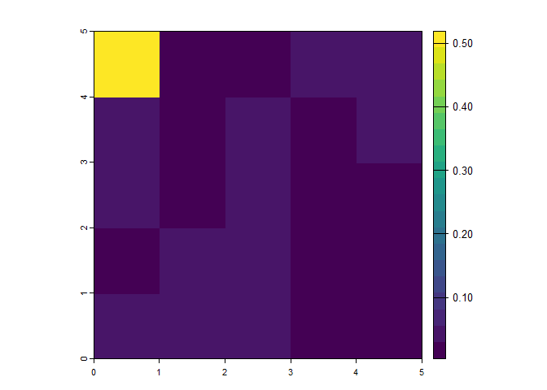

Calculating the Biodiversity Intactness Index: the PREDICTS
implementation
================
Adriana De Palma, Katia Sanchez-Ortiz, Helen R.P. Phillips and Andy
Purvis
05 February, 2024

-   <a href="#about-predicts" id="toc-about-predicts">About PREDICTS</a>
-   <a href="#about-bii" id="toc-about-bii">About BII</a>
-   <a href="#load-some-packages" id="toc-load-some-packages">Load some
    packages</a>
-   <a href="#prepare-the-biodiversity-data"
    id="toc-prepare-the-biodiversity-data">Prepare the biodiversity data</a>
-   <a href="#calculate-diversity-indices"
    id="toc-calculate-diversity-indices">Calculate diversity indices</a>
    -   <a href="#total-abundance" id="toc-total-abundance">Total Abundance</a>
    -   <a href="#compositional-similarity"
        id="toc-compositional-similarity">Compositional Similarity</a>
-   <a href="#run-the-statistical-analysis"
    id="toc-run-the-statistical-analysis">Run the statistical analysis</a>
    -   <a href="#total-abundance-1" id="toc-total-abundance-1">Total
        Abundance</a>
    -   <a href="#compositional-similarity-1"
        id="toc-compositional-similarity-1">Compositional Similarity</a>
-   <a href="#projecting-the-model" id="toc-projecting-the-model">Projecting
    the model</a>
    -   <a href="#model-predictions" id="toc-model-predictions">Model
        predictions</a>
    -   <a href="#gather-land-use-rasters"
        id="toc-gather-land-use-rasters">Gather land-use rasters</a>
    -   <a href="#spatial-projections-of-bii"
        id="toc-spatial-projections-of-bii">Spatial projections of BII</a>
-   <a href="#extensions" id="toc-extensions">Extensions</a>
    -   <a href="#validation" id="toc-validation">Validation</a>
-   <a href="#advantages" id="toc-advantages">Advantages</a>
-   <a href="#limitations" id="toc-limitations">Limitations</a>
    -   <a href="#assumptions-of-predicts"
        id="toc-assumptions-of-predicts">Assumptions of PREDICTS</a>
    -   <a href="#uncertainty" id="toc-uncertainty">Uncertainty</a>
    -   <a href="#bii-is-a-valuable-metric-but-isnt-the-only-answer"
        id="toc-bii-is-a-valuable-metric-but-isnt-the-only-answer">BII is a
        valuable metric, but isn’t the only answer</a>
-   <a href="#r-info" id="toc-r-info">R Info</a>
-   <a href="#acknowledgements"
    id="toc-acknowledgements">Acknowledgements</a>

This tutorial gives a step-by-step guide on how to calculate the
Biodiversity Intactness Index (BII) using the PREDICTS database. We’ll
go through where to find the PREDICTS data, how we go about analysing
this data and finally how to project and calculate BII, using `R`. We’ll
be using just a subset of the data and a very simple model to start
with.

You can explore the results from our most up-to-date global models on
the Natural History Museum’s <a
href="https://www.nhm.ac.uk/our-science/data/biodiversity-indicators/biodiversity-intactness-index-data?future-scenario=ssp2_rcp4p5_message_globiom&amp;georegion=001&amp;min-year=1970&amp;max-year=2050&amp;georegion-compare=null&amp;show-uncertainty=true"
target="_blank">Biodiversity Trends Explorer</a>. This online tool
allows users to explore historical and potential future trends in BII
for different geographic units (e.g., countries, regions, global).

# About PREDICTS

<details>
<summary>
<a
href="https://www.nhm.ac.uk/our-science/research/projects/predicts.html"
target="_blank">PREDICTS</a> – Projecting Responses of Ecological
Diversity In Changing Terrestrial Systems – is a collaboration that aims
to model how local terrestrial biodiversity worldwide responds to land
use and related pressures, and to use such models to project how
biodiversity may change under future socioeconomic scenarios. *Expand to
learn more*
</summary>

The PREDICTS team have collated a large database of biodiversity data
from over 29,000 sites worldwide. These data have been provided by
authors of over 700 separate surveys, each of which sampled biodiversity
at multiple sites facing different land-use and related pressures.
Although the different surveys have used a very wide range of different
techniques, and focused on a wide array of different plant, fungal,
invertebrate or vertebrate taxa (the database now holds data from over
50,000 species), the data from different sites within a survey are
comparable, having been collected in the same way. Each site’s land use
and land-use intensity has been classified into a consistent set of
categories, based on information in the paper or from the authors, and
some other human pressures (e.g., human population density) are
estimated for each site from global rasters. Details of how the database
was put together – including definitions of our land-use and
use-intensity classes – can be found in
<a href="https://onlinelibrary.wiley.com/doi/full/10.1002/ece3.1303"
target="_blank">this paper</a>; the first released version of the
database is available from the
<a href="https://data.nhm.ac.uk/" target="_blank">Natural History
Museum’s data portal</a>, and is described in
<a href="https://onlinelibrary.wiley.com/doi/full/10.1002/ece3.2579"
target="_blank">this paper</a>.

Because the database holds the original biodiversity data, statistical
analysis can model a wide range of response variables (as explained in
<a
href="https://www.sciencedirect.com/science/article/pii/S0065250417300284"
target="_blank">this paper</a>), including site-level measures of
diversity (such as <a href="https://www.nature.com/articles/nature14324"
target="_blank">within-sample species richness, rarefaction-based
richness or overall organismal abundance</a>),
<a href="https://onlinelibrary.wiley.com/doi/full/10.1111/ecog.01932"
target="_blank">among-site differences in community composition</a>, or
<a
href="https://besjournals.onlinelibrary.wiley.com/doi/full/10.1111/1365-2664.12524"
target="_blank">the occurrence and/or population size of each
species</a>. Combining our data with other species-level information
permits modelling of
<a href="https://onlinelibrary.wiley.com/doi/10.1111/ddi.12638"
target="_blank">functional and phylogenetic diversity</a> or of <a
href="https://journals.plos.org/plosbiology/article?id=10.1371/journal.pbio.2006841"
target="_blank">a community-weighted measure of geographic range
size</a>. This walkthrough document focuses on modelling two response
variables: total site-level abundance, and compositional similarity
between sites.

Because the surveys in the database arise from such very different
methodologies, we fit mixed-effects models with survey-level random
effects, allowing us to focus on how human pressures affect the response
variable while acknowledging the among-survey heterogeneity. We assume
that biotic differences among matched sites with different land uses are
caused by the land-use difference, a form of space-for-time
substitution. Some of our models also assume that the biota at sites
with minimally-used primary vegetation (and minimal levels of other
pressures) approximates their pristine biota. These assumptions would
not be needed if representative long-term temporal data were available.

Models can be fitted to the whole global data or to regions of
particular interest (such as
<a href="https://www.nature.com/articles/s41598-021-98811-1"
target="_blank">tropical and subtropical forest biomes</a>). The models
can be combined with detailed spatiotemporal data on the pressures
<a href="https://onlinelibrary.wiley.com/doi/10.1111/ddi.12638"
target="_blank">to map the projected current state of the response
variable</a>,
<a href="https://www.nature.com/articles/s41598-021-98811-1"
target="_blank">estimate how it has changed in the past</a>, or
<a href="https://www.biorxiv.org/content/10.1101/311787v1"
target="_blank">project its future under alternative scenarios</a>.
</details>

# About BII

<details>
<summary>
The Biodiversity Intactness Index (BII) was initially
<a href="https://www.nature.com/articles/nature03289"
target="_blank">proposed in 2005</a> as a sound, sensitive, easily
understood and affordable biodiversity indicator that could easily be
applied at any spatial scale and would allow for comparison with a
policy target and a baseline. BII is defined as the average abundance,
across a large and functionally diverse set of species, relative to
their reference populations (which would ideally be populations before
any impacts of modern industrial society, but which practically have to
be populations in the least impacted settings available); non-native
species are excluded from the calculation. *Expand to learn more*
</summary>

BII became more prominent with its adoption in the
<a href="https://science.sciencemag.org/content/347/6223/1259855"
target="_blank">2015 revision of the Planetary Boundaries framework</a>
as an interim measure of biosphere integrity. The framework proposed
that reduction of average BII to below 90% across a large region such as
a biome would risk large-scale disruption of the flow of ecosystem
services and jeopardise sustainable development, though the paper
acknowledged that the precise placement of the ‘safe limit’ for BII was
very uncertain.

In the absence of sufficient collated biodiversity data, BII was
initially <a href="https://www.nature.com/articles/nature03289"
target="_blank">estimated</a> using carefully-structured expert opinion.
The PREDICTS team
<a href="https://science.sciencemag.org/content/353/6296/288"
target="_blank">first estimated BII based on primary biodiversity data
in 2016</a>, by combining two statistical models – one of site-level
organismal abundance, and one of compositional similarity to a site
still having primary vegetation. The latter model was needed to account
for the fact that models of overall organismal abundance do not consider
turnover in species composition. Although we gave several reasons why
our estimates of BII were likely to be overoptimistic, our 2016
estimates nonetheless placed the world, nearly all biomes and nearly all
biodiversity hotspots below the proposed ‘safe limit’ for BII.

We have <a href="https://www.nature.com/articles/s41598-021-98811-1"
target="_blank">continued to refine the modelling framework to improve
our estimates of BII</a>. The most important improvements since the 2016
paper have been:

-   Use of a more stringent baseline in models of compositional
    similarity. Whereas the 2016 paper used all primary vegetation sites
    (even those with intense human use) as the baseline land use, growth
    of the database and a switch to a more efficient (matrix-based)
    model framework have allowed us to use a more suitable baseline.
    Depending on the analysis, this could include only minimally-used
    primary vegetation as the baseline, or it could include a mixture of
    minimally- and lightly-used primary vegetation as well as
    minimally-used mature secondary vegetation.
-   A more principled transformation of the compositional similarity
    estimates prior to modelling. Although the log-transformation used
    in the 2016 paper produced acceptable model diagnostics, it does not
    recognise the bounded nature of compositional similarity (which can
    range from 0 to 1). We now use a logit transformation instead, which
    provides more sensitive discrimination among land uses.

The estimates of BII that result from the improved framework tend to be
<a href="https://www.nature.com/articles/s41559-019-0896-0"
target="_blank">markedly lower than those we obtained in 2016</a>. One
issue that remains to be addressed is that the land-use rasters we have
been using to make spatial projections do not accurately differentiate
planted from natural forest, meaning our estimates are still likely to
be too high in regions with extensive planted forest. Work to address
this shortcoming is underway.

More recently, we have begun to use a more conservative measure of
compositional similarity. Our analyses previously used the asymmetric
Jaccard Index, which considers only species identity, but not structure;
for example, shifts in dominance. To account for changes in both species
identity and community structure due to human activities, we have now
implemented the <a
href="https://besjournals.onlinelibrary.wiley.com/doi/10.1111/2041-210X.12693"
target="_blank">balanced Bray-Curtis index</a>. You’ll find more
information about the differences between the indices below.

BII, being an indicator of the average state of local ecological
communities, complements indicators based on species’ global
conservation status (such as the Sampled Red List Index), or on
population trends (such as the Living Planet Index). These different
facets of biodiversity are all important, and
<a href="https://www.nature.com/articles/s41893-018-0130-0"
target="_blank">can be combined to provide a roadmap towards restoring
global biodiversity</a>.
</details>

# Load some packages

``` r
library(dplyr) # for easy data manipulation
library(tidyr) # ditto
library(tibble) # ditto
library(lme4) # for mixed effects models
library(car) # for logit transformation with adjustment
library(betapart) # for calculating balanced bray-curtis dissimilarity
library(terra) # for working with raster data
library(geosphere) # calculating geographic distance between sites
library(purrr) # running loops
library(furrr) # running loops in parallel
library(viridis) # figure colours for colour blindness
```

# Prepare the biodiversity data

You can download the PREDICTS data from the
<a href="https://data.nhm.ac.uk/dataset/the-2016-release-of-the-predicts-database-v1-1" target="_blank">Natural
History Museum data portal<a/>. If you’re working in `R`, the database
in `.rds` format will be much quicker to load in than the `.csv` file.

Once you’ve downloaded the database, read it in. We are going to filter
the data for just the Americas, to make the data manipulation and
modelling a bit quicker. You can calculate BII for *any* region of the
world for which there are data, although we tend to do our BII modelling
on a global scale or at least across multiple biomes.

``` r
# read in the data
diversity <- readRDS("database.rds") |>
  
  # now let's filter out just the data for the Americas
  dplyr::filter(UN_region == "Americas")

dplyr::glimpse(diversity)
```

    ## Rows: 825,682
    ## Columns: 67
    ## $ Source_ID                               <fct> AD1_2005__Shuler, AD1_2005__Sh…
    ## $ Reference                               <fct> Shuler et al. 2005, Shuler et …
    ## $ Study_number                            <int> 1, 1, 1, 1, 1, 1, 1, 1, 1, 1, …
    ## $ Study_name                              <fct> "Shuler2005_flowervisitation",…
    ## $ SS                                      <fct> AD1_2005__Shuler 1, AD1_2005__…
    ## $ Diversity_metric                        <fct> effort-corrected abundance, ef…
    ## $ Diversity_metric_unit                   <fct> effort-corrected individuals, …
    ## $ Diversity_metric_type                   <fct> Abundance, Abundance, Abundanc…
    ## $ Diversity_metric_is_effort_sensitive    <lgl> FALSE, FALSE, FALSE, FALSE, FA…
    ## $ Diversity_metric_is_suitable_for_Chao   <lgl> FALSE, FALSE, FALSE, FALSE, FA…
    ## $ Sampling_method                         <fct> systematic searching, systemat…
    ## $ Sampling_effort_unit                    <fct> day, day, day, day, day, day, …
    ## $ Study_common_taxon                      <fct> Hymenoptera, Hymenoptera, Hyme…
    ## $ Rank_of_study_common_taxon              <fct> Order, Order, Order, Order, Or…
    ## $ Site_number                             <int> 1, 1, 1, 1, 1, 2, 2, 2, 2, 2, …
    ## $ Site_name                               <fct> "Ayrshire Farms", "Ayrshire Fa…
    ## $ Block                                   <fct> "", "", "", "", "", "", "", ""…
    ## $ SSS                                     <fct> AD1_2005__Shuler 1 1, AD1_2005…
    ## $ SSB                                     <fct> "AD1_2005__Shuler 1 ", "AD1_20…
    ## $ SSBS                                    <fct> "AD1_2005__Shuler 1  1", "AD1_…
    ## $ Sample_start_earliest                   <date> 2003-07-07, 2003-07-07, 2003-…
    ## $ Sample_end_latest                       <date> 2003-08-05, 2003-08-05, 2003-…
    ## $ Sample_midpoint                         <date> 2003-07-21, 2003-07-21, 2003-…
    ## $ Sample_date_resolution                  <fct> day, day, day, day, day, day, …
    ## $ Max_linear_extent_metres                <dbl> 2844.9464, 2844.9464, 2844.946…
    ## $ Habitat_patch_area_square_metres        <dbl> 4046856.4, 4046856.4, 4046856.…
    ## $ Sampling_effort                         <dbl> 1, 1, 1, 1, 1, 1, 1, 1, 1, 1, …
    ## $ Rescaled_sampling_effort                <dbl> 1, 1, 1, 1, 1, 1, 1, 1, 1, 1, …
    ## $ Habitat_as_described                    <fct> "Squash or pumpkin farm", "Squ…
    ## $ Predominant_land_use                    <fct> Cropland, Cropland, Cropland, …
    ## $ Source_for_predominant_land_use         <fct> Direct from publication / auth…
    ## $ Use_intensity                           <fct> Light use, Light use, Light us…
    ## $ Km_to_nearest_edge_of_habitat           <dbl> NA, NA, NA, NA, NA, NA, NA, NA…
    ## $ Years_since_fragmentation_or_conversion <dbl> NA, NA, NA, NA, NA, NA, NA, NA…
    ## $ Transect_details                        <fct> "", "", "", "", "", "", "", ""…
    ## $ Coordinates_method                      <fct> Direct from publication / auth…
    ## $ Longitude                               <dbl> -77.86848, -77.86848, -77.8684…
    ## $ Latitude                                <dbl> 38.95733, 38.95733, 38.95733, …
    ## $ Country_distance_metres                 <dbl> 0, 0, 0, 0, 0, 0, 0, 0, 0, 0, …
    ## $ Country                                 <fct> "United States", "United State…
    ## $ UN_subregion                            <fct> North America, North America, …
    ## $ UN_region                               <fct> Americas, Americas, Americas, …
    ## $ Ecoregion_distance_metres               <dbl> 0, 0, 0, 0, 0, 0, 0, 0, 0, 0, …
    ## $ Ecoregion                               <fct> "Piedmont", "Piedmont", "Piedm…
    ## $ Biome                                   <fct> "Temperate Broadleaf & Mixed F…
    ## $ Realm                                   <fct> Nearctic, Nearctic, Nearctic, …
    ## $ Hotspot                                 <fct> , , , , , , , , , , , , , , , …
    ## $ Wilderness_area                         <fct> , , , , , , , , , , , , , , , …
    ## $ Taxon_number                            <int> 1, 2, 3, 4, 5, 1, 2, 3, 4, 5, …
    ## $ Taxon_name_entered                      <fct> "Apis mellifera", "Peponapis p…
    ## $ Indication                              <fct> "Hymenoptera: Apidae sensu lat…
    ## $ Parsed_name                             <fct> "Apis mellifera", "Peponapis p…
    ## $ Taxon                                   <fct> Apis mellifera, Peponapis prui…
    ## $ COL_ID                                  <int> 6845885, 6927991, 13025322, 69…
    ## $ Name_status                             <fct> accepted name, accepted name, …
    ## $ Rank                                    <fct> Species, Species, Family, Spec…
    ## $ Kingdom                                 <fct> Animalia, Animalia, Animalia, …
    ## $ Phylum                                  <fct> Arthropoda, Arthropoda, Arthro…
    ## $ Class                                   <fct> Insecta, Insecta, Insecta, Ins…
    ## $ Order                                   <fct> Hymenoptera, Hymenoptera, Hyme…
    ## $ Family                                  <fct> Apidae, Apidae, Halictidae, Ap…
    ## $ Genus                                   <fct> Apis, Peponapis, , Melissodes,…
    ## $ Species                                 <fct> mellifera, pruinosa, , bimacul…
    ## $ Best_guess_binomial                     <fct> Apis mellifera, Peponapis prui…
    ## $ Higher_taxon                            <fct> Hymenoptera, Hymenoptera, Hyme…
    ## $ Measurement                             <dbl> 0.00, 0.75, 0.00, 0.00, 0.00, …
    ## $ Effort_corrected_measurement            <dbl> 0.00, 0.75, 0.00, 0.00, 0.00, …

<a href="https://onlinelibrary.wiley.com/doi/full/10.1002/ece3.1303"
target="_blank">This paper</a> describes the PREDICTS database structure
and content. Briefly, the database consists of a number of different
sources (journal articles), `Source_ID` in the database, within which
there can be multiple studies (`Study_name` and `Study_number`). Within
each study, there are multiple sites (`Site_name` and `Site_number`)
within blocks (`Block`). For ease, we use the combined, shorthand values
for these: `SS` (`Study_number` and `Source_ID`), `SSB` (`SS` and
`Block`) and `SSBS` (`SSB` and`Site_number`).

Now let’s explore the data a little.

``` r
table(diversity$Predominant_land_use, diversity$Use_intensity)
```

    ##                                           
    ##                                            Minimal use Light use Intense use
    ##   Primary vegetation                            163180     73282       22783
    ##   Young secondary vegetation                     48407      9427        3673
    ##   Intermediate secondary vegetation              51349     12948        1041
    ##   Mature secondary vegetation                    39909      5936         396
    ##   Secondary vegetation (indeterminate age)       32584     10349         373
    ##   Plantation forest                               9168     17946        9429
    ##   Pasture                                        38321     94681        2612
    ##   Cropland                                       13184     37335       18751
    ##   Urban                                           7431      5547        1772
    ##   Cannot decide                                      0         0           0
    ##                                           
    ##                                            Cannot decide
    ##   Primary vegetation                               12828
    ##   Young secondary vegetation                        7467
    ##   Intermediate secondary vegetation                 5135
    ##   Mature secondary vegetation                       2814
    ##   Secondary vegetation (indeterminate age)          5407
    ##   Plantation forest                                 2985
    ##   Pasture                                          29274
    ##   Cropland                                         24188
    ##   Urban                                              332
    ##   Cannot decide                                     3438

There’s lots of data for the Americas across all land-use and intensity
classes. Since we’re using a simplified model for illustration purposes,
we’re not going to look at *all* the use intensities here. However, we
will keep *minimally-used primary vegetation* separate, as this is the
closest we have to a *pristine* baseline.

So let’s collapse down the data. Note that we’re doing this purely to
make the example simpler. In reality, we include multiple land use and
intensity combinations, including the age class of secondary vegetation
when possible.

``` r
diversity <- diversity |>
  # make a level of Primary minimal. Everything else gets the coarse land use
  dplyr::mutate(
    LandUse = ifelse(Predominant_land_use == "Primary vegetation" & Use_intensity == "Minimal use",
                     "Primary minimal",
                     paste(Predominant_land_use)),
    
    # collapse the secondary vegetation classes together
    LandUse = ifelse(grepl("secondary", tolower(LandUse)),
                     "Secondary vegetation",
                     paste(LandUse)),
    
    # change cannot decide into NA
    LandUse = ifelse(Predominant_land_use == "Cannot decide",
                     NA, 
                     paste(LandUse)),
    
    # relevel the factor so that Primary minimal is the first level (so that it is the intercept term in models)
    LandUse = factor(LandUse),
    LandUse = relevel(LandUse, ref = "Primary minimal")
  )
```

# Calculate diversity indices

The Biodiversity Intactness Index is derived from combining two models:
one of total abundance, and one of compositional similarity. We’re going
to calculate these diversity metrics now.

## Total Abundance

Total abundance is simply the sum of all individuals sampled at each
site.

``` r
abundance_data <- diversity |>
  
  # pull out just the abundance measures
  dplyr::filter(Diversity_metric_type == "Abundance") |>
  
  # group by SSBS (each unique value corresponds to a unique site)
  dplyr::group_by(SSBS) |>
  
  # now add up all the abundance measurements within each site
  dplyr::mutate(TotalAbundance = sum(Effort_corrected_measurement)) |>
  
  # ungroup
  dplyr::ungroup() |>
  
  # pull out unique sites
  dplyr::distinct(SSBS, .keep_all = TRUE) |>
  
  # now group by Study ID
  dplyr::group_by(SS) |>
  
  # pull out the maximum abundance for each study
  dplyr::mutate(MaxAbundance = max(TotalAbundance)) |>
  
  # ungroup
  dplyr::ungroup() |>
  
  # now rescale total abundance, so that within each study, abundance varies from 0 to 1.
  dplyr::mutate(RescaledAbundance = TotalAbundance/MaxAbundance)
```

Note that here we are using the `Effort_corrected_measurement`. For some
studies, the sampling effort (but not the method) can vary slightly
among sites. To account for this, we assume that abundance increases
linearly with sampling effort (validated
<a href="https://www.nature.com/articles/srep31153"
target="_blank">here</a>) – i.e., the abundance measurement is divided
by the sampling effort so that it is transformed to abundance per unit
effort. This is ok for modelling total abundance, but we can’t account
for how the *identity* or *number* of species varies with sampling
effort in the same simple way. So in the next stage where species
identity matters, you’ll see that we’re using the `Measurement` field
(raw reported abundance), and will only use studies where the sampling
effort does not vary among sites.

## Compositional Similarity

Up until recently, we used the *asymmetric Jaccard Index* as our measure
of compositional similarity. Essentially, we wanted to know what species
are present in our baseline sites (`Primary minimal`), and then for our
converted sites (all other land uses), what proportion of individuals
come from species that are also found in the baseline site. We’re now
using a more sensitive measure of compositional similarity – *balanced
Bray-Curtis* – that considers changes in community structure, rather
than just identity.

Let’s take a look at a couple of examples to illustrate the differences
between these two measures of compositional similarity.

*Example 1:*

| Site                    | Species A | Species B | Species C | Species D |
|:------------------------|:---------:|:---------:|:---------:|:---------:|
| Site 1: Primary minimal |    35     |    15     |     0     |     0     |
| Site 2: Cropland        |    15     |    35     |     0     |     0     |

Here we’ve got no new species and no changes in abundance, but the
dominance structure has totally changed – Species A is the most dominant
in Site 1, but Species B is most dominant in Site 2. The *asymmetric
Jaccard Index* would say that these sites have a similarity of 1,
because there are no novel species (100% of the individuals come from
‘originally-present species’). Our new measure, however, would say that
there is a similarity of 0.6, because there has been a change in
community structure.

*Example 2:*

| Site                    | Species A | Species B | Species C | Species D |
|:------------------------|:---------:|:---------:|:---------:|:---------:|
| Site 1: Primary minimal |    35     |    24     |     0     |     1     |
| Site 2: Cropland        |    10     |     0     |    45     |     5     |

In this example, we’ve got some new species in the Cropland site, a
shift in dominance (Species A is the most dominant in Primary minimal,
but not in Cropland), but the same overall abundance in both sites.

When we calculate the compositional similarity using our previous
measure, we get a value of 0.25 (because 15 out of the 60 individuals in
Site 2 were also present in Site 1), but with our new measure, we get a
value of 0.18.

Now, for every study with a `Primary minimal` site, we want to calculate
this compositional similarity measure against every other site in the
study. Note that this has to be done *within* studies: it would be
pointless to compare similarity between a site from a study of birds
with a site from a study of bees.

Let’s first set up the data we’re going to use for the compositional
similarity models.

``` r
cd_data_input <- diversity |>
  
  # drop any rows with unknown LandUse
  dplyr::filter(!is.na(LandUse)) |>
  
  # pull out only the abundance data
  dplyr::filter(Diversity_metric_type == "Abundance") |>
  
  # group by Study
  dplyr::group_by(SS) |>
  
  # calculate the number of unique sampling efforts within that study
  dplyr::mutate(n_sample_effort = dplyr::n_distinct(Sampling_effort)) |>
  
  # calculate the number of unique species sampled in that study
  dplyr::mutate(n_species = dplyr::n_distinct(Taxon_name_entered)) |>
  
  # check if there are any Primary minimal sites in the dataset
  dplyr::mutate(n_primin_records = sum(LandUse == "Primary minimal")) |>
  
  # ungroup
  dplyr::ungroup() |>
  
  # now keep only the studies with one unique sampling effort
  dplyr::filter(n_sample_effort == 1) |>
  
  # and keep only studies with more than one species 
  # as these studies clearly aren't looking at assemblage-level diversity
  dplyr::filter(n_species > 1) |>
  
  # and keep only studies with at least some Primary minimal data
  dplyr::filter(n_primin_records > 0) |>
  
  # drop empty factor levels
  droplevels()
```

Now we’ll set up a function to calculate compositional similarity
between a single pair of sites in a study (See the previous version of
this walkthrough for the function for calculating the asymmetrical
Jaccard’s similarity).

``` r
get_bray <- function(s1, s2, data){
  
  sp_data <- data |>
    
    # filter out the SSBS that matches the pair of sites we're interested in
    dplyr::filter(SSBS %in% c(s1, s2)) |>
    
    # pull out the site name, species name and abundance information
    dplyr::select(SSBS, Taxon_name_entered, Measurement) |>
    
    # pivot so that each column is a species and each row is a site
    tidyr::pivot_wider(names_from = Taxon_name_entered, values_from = Measurement) |>
    
    # set the rownames to the SSBS and then remove that column
    tibble::column_to_rownames("SSBS")
  
  # if one of the sites doesn't have any individuals in it
  # i.e. the row sum is 0
  if(sum(rowSums(sp_data) == 0, na.rm = TRUE) == 1){
    # then the similarity between sites should be 0
    bray <- 0
  # if both sites have no individuals
  }else if(sum(rowSums(sp_data) == 0, na.rm = TRUE) == 2){
    # then class the similarity as NA
    bray <- NA
  # otherwise if both sites have individuals, calculate the balanced bray-curtis
  # as similarity (1-bray)
  }else{
    bray <- 1 - 
      betapart::bray.part(sp_data) |>
      purrr::pluck("bray.bal") |>
      purrr::pluck(1)
  }
  
}
```

Now that we’ve got the function to gather the data for the compositional
similarity models, let’s get the dataset. We’ll first get together a
vector of all the study IDs that we need to perform the calculations
for.

``` r
# get a vector of each study to loop over
studies <- cd_data_input |>
  dplyr::distinct(SS) |>
  dplyr::pull()
```

Next, get all the site comparisons for each study. We’re using the
`purrr:map` function here which will loop over each study in turn and
perform the custom function we’ve specified. Note that we’re using
`map_dfr` because at the end, I’d like a dataframe where each row gives
the pair of sites that need comparing.

``` r
site_comparisons <- purrr::map_dfr(
  .x = studies, 
  .f = function(x){
    
    # filter out the given study
    site_data <- dplyr::filter(cd_data_input, SS == x) |>
      # pull out the SSBS and LandUse information
      dplyr::select(SSBS, LandUse) |>
      # simplify the data so we only have one row for each site
      dplyr::distinct(SSBS, .keep_all = TRUE)
    
    # pull out the sites that are Primary minimal (we only want to use comparisons with the baseline)
    baseline_sites <- site_data |>
      dplyr::filter(LandUse == "Primary minimal") |>
      dplyr::pull(SSBS)
    
    # pull out all the sites
    site_list <- site_data |>
      dplyr::pull(SSBS)
    
    # get all site x site comparisons for this study
    site_comparisons <- expand.grid(baseline_sites, site_list) |>
      
      # rename the columns so they will be what the compositional similarity function expects for ease
      dplyr::rename(s1 = Var1, s2 = Var2) |>
      
      # remove the comparisons where the same site is being compared to itself
      dplyr::filter(s1 != s2) |>
      
      # make the values characters rather than factors
      dplyr:: mutate(
        s1 = as.character(s1),
        s2 = as.character(s2),
        
        # add the full name
        contrast = paste(s1, "vs", s2, sep = "_"),
        
        # add the study id
        SS = as.character(x)
      )
    
    return(site_comparisons)
  }
)
```

For each study and set of comparisons, we need to calculate the
compositional similarity. We’re going to set this up to run in parallel.
The following code uses the `purrr::map` functions (made to run in
parallel using the `{furrr}` package), but there are other options, like
`for` loops or `apply`.

``` r
future::plan("multisession", workers = parallel::detectCores()-1)

# We're using map2 (because there are two arguments we're passing through - s1 and s2)
# and the map2_dbl because the output we want is a vector of numbers (double rather than integer format)
# so this function is going to go through each s1 and s2 in turn
# and pass them into the get_bray function
bray <- furrr::future_map2_dbl(
  .x = site_comparisons$s1,
  .y = site_comparisons$s2,
  ~get_bray(s1 = .x, s2 = .y, data = cd_data_input),
  .options = furrr::furrr_options(seed = TRUE)
)

# stop running things in parallel for now
future::plan("sequential")
```

Next we’ll pull out the additional data we need (which don’t require a
loop), including the geographic distance between sites and the land
uses.

``` r
# for the other required information, we don't need to run loops
latlongs <- cd_data_input |>
  # for each site in the dataset
  dplyr::group_by(SSBS) |>
  # pull out the lat and long
  dplyr::summarise(
    Lat = unique(Latitude),
    Long = unique(Longitude)
  )

lus <- cd_data_input |>
  # for each site in the dataset
  dplyr::group_by(SSBS) |>
  # pull out the land use
  dplyr::summarise(lu = unique(LandUse))
```

Let’s put all the data together into a dataset we can use for modelling.

``` r
# now let's put all the data together
cd_data <- site_comparisons |>
  # add in the bray-curtis data
  # which is already in the same order as site_comparisons
  dplyr::mutate(bray = bray) |>
  # get the lat and long for s1
  dplyr::left_join(latlongs, by = c("s1" = "SSBS")) |>
  dplyr::rename(s1_lat = Lat, s1_long = Long) |>
  # get the lat and long for s2
  dplyr::left_join(latlongs, by = c("s2" = "SSBS")) |>
  dplyr::rename(s2_lat = Lat, s2_long = Long) |>
  # calculate the geographic distances between s1 and s2 sites
  dplyr::mutate(
    geog_dist = geosphere::distHaversine(
      cbind(s1_long, s1_lat), cbind(s2_long, s2_lat)
    )
  ) |>
  # get the land use for s1
  dplyr::left_join(lus, by = c("s1" = "SSBS")) |>
  dplyr::rename(s1_lu = lu) |>
  # get the land use for s2
  dplyr::left_join(lus, by = c("s2" = "SSBS")) |>
  dplyr::rename(s2_lu = lu) |>
  # create an lu_contrast column (what we'll use for modelling)
  dplyr::mutate(lu_contrast = paste(s1_lu, s2_lu, sep = "_vs_"))
```

# Run the statistical analysis

In the PREDICTS database, most of the variation in diversity is going to
be between Studies – each study looks at different species groups in
different areas using different sampling methods. This has to be
accounted for in the statistical analysis. We do this in a mixed effects
framework: we treat studies and blocks as random effects.

## Total Abundance

Let’s start with a simple model of total abundance. Note that the errors
in models of ecological abundance are generally non-normal. Usually, we
would deal with that by modelling abundance with an error structure,
such as poisson or quasipoisson. However, in the PREDICTS database, we
take quite a broad view of what counts as an ‘abundance’ measurement –
they are not all whole individuals so they aren’t whole numbers (e.g.,
they might be expressed as average numbers per square metre). The
`{lme4}` package doesn’t really like you using a discrete error
structure with continuous data. So instead, we must transform the data.
Generally, a log-transformation does well, but in some cases, a
square-root transformation helps to normalise the errors. *We’re not
going to go through model checking with you here – this is all just to
give you an idea of how to model BII, not how to do statistical
analysis… Please check your residual plots etc before using models to
make inferences and spatial projections!*

``` r
# run a simple model
ab_m <- lme4::lmer(
  sqrt(RescaledAbundance) ~ LandUse + (1|SS) + (1|SSB), 
  data = abundance_data
)
summary(ab_m)
```

    ## Linear mixed model fit by REML ['lmerMod']
    ## Formula: sqrt(RescaledAbundance) ~ LandUse + (1 | SS) + (1 | SSB)
    ##    Data: abundance_data
    ## 
    ## REML criterion at convergence: -3249.4
    ## 
    ## Scaled residuals: 
    ##     Min      1Q  Median      3Q     Max 
    ## -3.7500 -0.5903 -0.0543  0.5417  4.4847 
    ## 
    ## Random effects:
    ##  Groups   Name        Variance Std.Dev.
    ##  SSB      (Intercept) 0.006687 0.08178 
    ##  SS       (Intercept) 0.024909 0.15783 
    ##  Residual             0.031871 0.17852 
    ## Number of obs: 6849, groups:  SSB, 725; SS, 215
    ## 
    ## Fixed effects:
    ##                              Estimate Std. Error t value
    ## (Intercept)                  0.645680   0.013895  46.468
    ## LandUseCropland             -0.022893   0.012609  -1.816
    ## LandUsePasture              -0.017283   0.009784  -1.766
    ## LandUsePlantation forest    -0.046771   0.013559  -3.449
    ## LandUsePrimary vegetation   -0.021176   0.010030  -2.111
    ## LandUseSecondary vegetation  0.033711   0.009015   3.739
    ## LandUseUrban                -0.071155   0.020363  -3.494
    ## 
    ## Correlation of Fixed Effects:
    ##             (Intr) LndUsC LndUsP LndUPf LndUPv LndUSv
    ## LndUsCrplnd -0.257                                   
    ## LandUsePstr -0.287  0.495                            
    ## LndUsPlnttf -0.266  0.222  0.291                     
    ## LndUsPrmryv -0.270  0.315  0.397  0.312              
    ## LndUsScndrv -0.365  0.418  0.525  0.370  0.451       
    ## LandUseUrbn -0.164  0.193  0.207  0.139  0.270  0.245

The model shows that all land uses except for secondary vegetation have
lower total abundance than the baseline (minimally-used primary
vegetation), some of them significantly so. We’ve just run a very simple
model here, but you can add in additional human pressures (e.g., human
population density).

## Compositional Similarity

Now let’s do a model of compositional similarity. For compositional
similarity models, we include a measure of the geographic distance
beween sites. This allows us to discount *natural* turnover in species
with distance. You can also include environmental distance (we’ve done
this previously based on Gower’s dissimilarity of climatic variables).
You might also want to include additional pressure variables in the
compositional similarity model, such as human population density and
road density. We usually do this by including the pressure at site 2
(the non-baseline site) as well as the *difference* in pressure between
site 1 and site 2.

The compositional similarity measure we use is bounded between 0 and 1 –
this means the errors will probably not be normally distributed.
Although log-transformation produced models with acceptable diagnostics,
it doesn’t respect the boundedness of the compositional similarity
measure. We’ve found that a logit transformation (with an adjustment to
account for 0s and 1s) also gives acceptable diagnostics and is
conceptually more appropriate as it does recognise the boundedness of
the data.

``` r
# there is some data manipulation we want to do before modelling
cd_data <- dplyr::mutate(
  cd_data,
  
  # logit transform the compositional similarity
  logitCS = car::logit(bray, adjust = 0.001, percents = FALSE),
  
  # log10 transform the geographic distance between sites
  log10geo = log10(geog_dist + 1),
  
  # make primary minimal-primary minimal the baseline again
  lu_contrast = factor(lu_contrast), 
  lu_contrast = relevel(lu_contrast, ref = "Primary minimal_vs_Primary minimal")
)


# Model compositional similarity as a function of the land-use contrast and the geographic distance between sites
cd_m <- lme4::lmer(
  logitCS ~ lu_contrast + log10geo + (1|SS) + (1|s2), 
  data = cd_data
)
summary(cd_m)
```

    ## Linear mixed model fit by REML ['lmerMod']
    ## Formula: logitCS ~ lu_contrast + log10geo + (1 | SS) + (1 | s2)
    ##    Data: cd_data
    ## 
    ## REML criterion at convergence: 621232
    ## 
    ## Scaled residuals: 
    ##     Min      1Q  Median      3Q     Max 
    ## -5.0890 -0.3566  0.0099  0.3990  5.3374 
    ## 
    ## Random effects:
    ##  Groups   Name        Variance Std.Dev.
    ##  s2       (Intercept) 2.231    1.494   
    ##  SS       (Intercept) 4.136    2.034   
    ##  Residual             6.675    2.584   
    ## Number of obs: 129562, groups:  s2, 3307; SS, 89
    ## 
    ## Fixed effects:
    ##                                                    Estimate Std. Error t value
    ## (Intercept)                                         1.02020    0.24105   4.232
    ## lu_contrastPrimary minimal_vs_Cropland             -1.36226    0.16083  -8.470
    ## lu_contrastPrimary minimal_vs_Pasture              -2.03204    0.10478 -19.393
    ## lu_contrastPrimary minimal_vs_Plantation forest    -0.38108    0.16542  -2.304
    ## lu_contrastPrimary minimal_vs_Primary vegetation   -0.24698    0.10510  -2.350
    ## lu_contrastPrimary minimal_vs_Secondary vegetation -0.09548    0.09937  -0.961
    ## lu_contrastPrimary minimal_vs_Urban                -1.46945    0.18335  -8.014
    ## log10geo                                           -0.22909    0.01122 -20.411
    ## 
    ## Correlation of Fixed Effects:
    ##             (Intr) l_Pm__C l_Pm__P l_Pm_f l_Pm__Pv l_Pm__Sv l_Pm__U
    ## l_cntrPm__C -0.069                                                 
    ## l_cntrPm__P -0.108  0.147                                          
    ## l_cntPm__Pf -0.114  0.089   0.164                                  
    ## l_cntPm__Pv -0.116  0.184   0.294   0.233                          
    ## l_cntPm__Sv -0.154  0.219   0.326   0.228  0.289                   
    ## l_cntrPm__U -0.063  0.185   0.124   0.088  0.230    0.109          
    ## log10geo    -0.168 -0.016  -0.023  -0.008 -0.025   -0.021   -0.026

Note that you can’t trust the significance values of these compositional
similarity values. The same site goes into multiple comparisons in the
model (each Primary minimal site is compared to all other sites in the
study), which will inflate the p-values. We’ve added in a random
intercept for site 2 (`s2`) to try to account for this, but really if
you want to look at significance values, you’ll need to use permutation
tests in order to see which effects are significant. We’re not going to
do that here because they can take a while.

# Projecting the model

Now we have one model (`ab_m`) telling us how land-use change influences
the total abundance of species and one model (`cs_m`) that tells how
similar the community structure is. Multiplying these together gives us
the BII: the intactness of nature in the system. We do this by
projecting abundance and compositional similarity onto rasters of
pressure data, and then multiplying the two output maps together. You
can use python to project predicts-style models
(<a href="https://github.com/ricardog/raster-project" target="_blank">See
here for the code</a>), but let’s do it using R so you can see
step-by-step exactly what’s happening.

## Model predictions

First of all, let’s use the models to predict the abundance and
compositional similarity in each land-use class, ignoring the impact of
random effects (see `help(predict.merMod)` for more details on this).

``` r
# let's start with the abundance model

# set up a dataframe with all the levels you want to predict diversity for
# so all the land-use classes in your model must be in here
newdata_ab <- data.frame(LandUse = levels(abundance_data$LandUse)) |>
  
  # now calculate the predicted diversity for each of these land-use levels
  # setting re.form = NA means random effect variance is ignored
  # then square the predictions (because we modelled the square root of abundance, so we have to back-transform it to get the real predicted values)
  dplyr::mutate(ab_m_preds = predict(ab_m, dplyr::across(dplyr::everything()), re.form = NA) ^ 2)


# now the compositional similarity model

# set up a function to calculate the inverse logit of the adjusted logit function we used
# where f is the value to be back-transformed and a is the adjustment value used for the transformation
inv_logit <- function(f, a){
  a <- (1-2*a)
  (a*(1+exp(f))+(exp(f)-1))/(2*a*(1+exp(f)))
}

# once again, set up the dataframe with all the levels you want to predict diversity for
# because we had an extra fixed effect in this model (log10geo), we also have to set a baseline level for this
# We're interested in the compositional similarity when we discount natural turnover, so we want to set this to a static value. We'll use 0 here, but we can also set it to the median geographic distance in the original data or any other meaningful level.
newdata_cd <- data.frame(
  lu_contrast = levels(cd_data$lu_contrast),
  log10geo = 0
) |>
  dplyr::mutate(
    cd_m_preds = predict(cd_m, dplyr::across(dplyr::everything()), re.form = NA) |>
      inv_logit(a = 0.001)
  )
```

It’s these *predicted* values (`ab_m_preds` and `cd_m_preds`) that we’re
going to use. We will multiply the predicted abundance and compositional
similarity in each land-use class with the area of the cell in that
land-use class. However, because we have a mixed effects model, the
*absolute* values are somewhat meaningless. Instead, we care about the
*relative* values – what is the abundance or compositional similarity
*relative* to what we’d find if the whole landscape was still
minimally-used primary vegetation. So once we have the predictions, we
divide by the reference value (the predicted abundance or compositional
similarity if the whole cell was minimally-used primary vegetation).

## Gather land-use rasters

You can use any land-use data you like, but many land-use maps don’t
have classes that map easily onto the definitions used by PREDICTS.
Notable exceptions are land-use maps developed for the Representative
Concentration Pathways
(<a href="http://luh.umd.edu/data.shtml#LUH1_Data" target="_blank">LUH1<a/>)
– because PREDICTS land-use classes were designed with these maps in
mind – and the derived fine-resolution product developed by
<a href="https://data.csiro.au/dap/landingpage?pid=csiro:15276&v=3&d=true" target="_blank">CSIRO<a/>.

We’re just going to simulate some rasters here for ease.

We’ve got seven land-use classes. Imagine we have seven rasters, one for
each land-use class, and the cell value is the proportion of the cell
assigned to that land-use class. We’ll generate some random numbers for
each of the land uses – let’s make it mostly cropland, with a fair chunk
of pasture and secondary vegetation, with just patches of natural land
and urban areas.

``` r
# generate a dataframe with random numbers for the cell values for each land-use class
lus <- data.frame(
  pri_min = rnorm(25, mean = 50, sd = 25),
  pri = rnorm(25, mean = 100, sd = 25),
  plant = rnorm(25, mean = 100, sd = 25),
  sec = rnorm(25, mean = 300, sd = 25),
  crop = rnorm(25, mean = 1000, sd = 25),
  pas = rnorm(25, mean = 400, sd = 25),
  urb = rnorm(25, mean = 50, sd = 25)
)

# let's artificially make the first cell dominated by urban land and the last cell dominated by minimally-used primary vegetation
lus$urb[1] <- 2000
lus$pri_min[25] <- 2000

lus <- lus |>
  # calculate the row totals
  dplyr::mutate(tot = rowSums(dplyr::across(dplyr::everything()))) |>
  
  # now, for each land use, divide the value by the rowsum
  # this will give us the proportion of each land use in each cell
  dplyr::transmute_at(1:7, list(~ ./tot))

# double check that the proportions of each land use sum to 1 (accounting for rounding errors)
all(zapsmall(rowSums(lus)) == 1)
```

    ## [1] TRUE

Now turn each land use into its own 5 $\times$ 5 raster.

``` r
# for each column of lus (i.e., each land use)
for(i in 1:ncol(lus)){
  
  # take the column and turn it into a 5 x 5 matrix
  ras <- matrix(lus[ , i], nrow = 5, ncol = 5) |>
    # turn that into a raster
    terra::rast()
  
  # come up with a name for the object to hold that raster
  nm <- paste(names(lus)[i], "raster", sep = "_")
  
  # and assign the raster to that name
  assign(x = nm, value = ras)
  
}
```

For example, here’s the raster showing the amount of urban land in each
cell:

``` r
terra::plot(urb_raster, col = viridis::viridis(20))
```

<!-- -->

## Spatial projections of BII

Calculate the output rasters for abundance (`ab_raster`) and
compositional similarity (`cd_raster`) by multiplying the predictions
for each land-use class by the amount of that land-use class in the
cell.

``` r
ab_raster <- (newdata_ab$ab_m_preds[newdata_ab$LandUse == 'Primary minimal'] * pri_min_raster + 
  newdata_ab$ab_m_preds[newdata_ab$LandUse == 'Primary vegetation'] * pri_raster + 
  newdata_ab$ab_m_preds[newdata_ab$LandUse == 'Plantation forest'] * plant_raster +
  newdata_ab$ab_m_preds[newdata_ab$LandUse == 'Secondary vegetation'] * sec_raster +
  newdata_ab$ab_m_preds[newdata_ab$LandUse == 'Cropland'] * crop_raster +
  newdata_ab$ab_m_preds[newdata_ab$LandUse == 'Pasture'] * pas_raster +
  newdata_ab$ab_m_preds[newdata_ab$LandUse == 'Urban'] * urb_raster) /
  
  # divide by the reference value
  newdata_ab$ab_m_preds[newdata_ab$LandUse == 'Primary minimal']


cd_raster <- (newdata_cd$cd_m_preds[newdata_cd$lu_contrast == 'Primary minimal_vs_Primary minimal'] * pri_min_raster + 
  newdata_cd$cd_m_preds[newdata_cd$lu_contrast == 'Primary minimal_vs_Primary vegetation'] * pri_raster + 
  newdata_cd$cd_m_preds[newdata_cd$lu_contrast == 'Primary minimal_vs_Plantation forest'] * plant_raster + 
  newdata_cd$cd_m_preds[newdata_cd$lu_contrast == 'Primary minimal_vs_Secondary vegetation'] * sec_raster +
  newdata_cd$cd_m_preds[newdata_cd$lu_contrast == 'Primary minimal_vs_Cropland'] * crop_raster +
  newdata_cd$cd_m_preds[newdata_cd$lu_contrast == 'Primary minimal_vs_Pasture'] * pas_raster +
  newdata_cd$cd_m_preds[newdata_cd$lu_contrast == 'Primary minimal_vs_Urban'] * urb_raster) /
  
  # divide by the reference value
  newdata_cd$cd_m_preds[newdata_cd$lu_contrast == 'Primary minimal_vs_Primary minimal']
```

The final step is to multiply the abundance and compositional similarity
rasters together. We’ll also multiply the values by 100 so that BII is
expressed as a percentage rather than a proportion.

``` r
bii <- ab_raster * cd_raster
terra::plot(bii * 100, col = viridis::viridis(20))
```

<!-- -->

Once you have your map of BII, you can calculate the average value
across any spatial scale. The average BII across this map is 60.39.

And that is it. A quick walkthrough of how we use the PREDICTS database
to model and project the Biodiversity Intactness Index.

# Extensions

-   The model framework is pretty flexible, so you can incorporate
    additional human pressures (like human population density and road
    density) into the statistical models of both abundance and
    compositional similarity.
-   If you’d like to *weight* your maps of BII, you can also multiply
    the outputs by additional layers, such as NPP, to give more weight
    to naturally more productive or more diverse areas.
-   If you have pressure data across time as well as space, you can look
    at temporal changes in BII (assuming that responses to pressures are
    the same across these time periods).

## Validation

Four approaches have been used to validate PREDICTS’ models and
estimates of BII.

1.  Jack-knifing has been used to assess whether any parameter estimates
    are unduly sensitive to particular individual studies
    (e.g. <a href="https://onlinelibrary.wiley.com/doi/full/10.1111/ddi.12478"
    target="_blank">this paper</a>).
2.  Cross-validation has been used to assess the robustness of parameter
    estimates. For example,
    <a href="https://www.nature.com/articles/nature14324"
    target="_blank">this paper</a> fitted models leaving out each biome
    in turn, ensuring that the global model was not driven by extreme
    estimates for any particular biome.
3.  We have tested whether model parameters differ significantly among
    regions or taxonomic groups by testing for region $\times$ pressure
    or group $\times$ pressure interactions, e.g.,
    <a href="https://www.nature.com/articles/srep31153" target="_blank">this
    paper</a> and
    <a href="https://link.springer.com/article/10.1007/s10531-017-1356-2"
    target="_blank">this paper</a>.
4.  <a
    href="https://zslpublications.onlinelibrary.wiley.com/doi/full/10.1111/acv.12327"
    target="_blank">One paper</a> collected field data on birds at sites
    in Tanzania and Kenya, and compared an Africa-wide PREDICTS
    biodiversity model with a bird model based on the independent field
    data.

A key assumption of our method for calculating BII is that species in
minimally-used primary vegetation are *native* species. This is not
always true, but we can’t always identify which species are native or
alien in the PREDICTS database. For island communities where we can
distinguish native species from alien species, we are working to compare
BII as calculated above (with an abundance model and compositional
similarity model) with BII modeled as the abundance of native species
only (with an abundance model of *only* native
species)(<a href="https://www.biorxiv.org/content/10.1101/2019.12.16.878041v1"
target="_blank">See here</a> for some of the results of this work).

# Advantages

-   BII is empirically derived from a transparent database.
-   BII has been proposed as an indicator useful in assessing whether we
    have transgressed Planetary Boundaries.
-   Because BII is an indicator of local biodiversity, you can simply
    average it across all the pixels in a region to get a summary of the
    average state of local biodiversity for that region.

# Limitations

## Assumptions of PREDICTS

There are some inherent assumptions in PREDICTS that we’ve mentioned
previously both in this document and in our papers. Firstly, we assume
that differences in biodiversity among matched sites with different land
uses are caused by the land-use difference. This is a form of
space-for-time substitution. In reality, it can take centuries for the
full impact of a land-use change to be seen in the ecological community;
in the models we’ve shown you above, we’ve assumed that the sites are at
their ‘equilibrium’ level of biodiversity so the full impact of land-use
change has already been felt. This won’t always be true. For secondary
vegetation sites, we can at least *try* to account for this by including
the broad ages of secondary vegetation. Ideally, we would use
time-series data to model biodiversity changes in response to land-use
change, but such surveys also have their own limitations that would
likely limit our ability to produce global models underpinned by
geographically and taxonomically representative data (<a
href="https://www.sciencedirect.com/science/article/pii/S0065250417300296"
target="_blank">see here</a> for a discussion of different data types
and their advantages and limitations). However, we’ve been working on a
database and modelling framework to attempt to validate our assumptions.

Secondly, the models presented in this walkthrough assume that the biota
at sites with minimally-used primary vegetation approximates their
pristine biota, when in reality, truly intact land is rare. It is likely
that many of the primary vegetations sites (even those that are
minimally used) will have had species filtered out by past disturbances
or will have experienced compositional changes due to disturbances in
the surrounding areas. We can try to account for additional pressures
affecting sites by including more variables in the models (e.g., human
population density and distance to the nearest road or road density).
However, we do not have *true* baseline sites with which we can make
biodiversity comparisons, because we don’t have representative long-term
data.

## Uncertainty

Hopefully it goes without saying, but the uncertainty in the BII map
will depend on its inputs, both in terms of the statistical models and
the geospatial data used for projections. The higher the uncertainty in
these aspects, the higher the uncertainty in the BII projections.
Although land-use mapping is continually advancing, there are still
limitations. So using a global map and then drilling down into a single
pixel is not really advisable. Instead, the maps are more likely to be
reliable when looking over broader areas and larger time steps, rather
than pixel by pixel and year by year.

Note that on the Natural History Museum’s <a
href="https://www.nhm.ac.uk/our-science/data/biodiversity-indicators/biodiversity-intactness-index-data?future-scenario=ssp2_rcp4p5_message_globiom&amp;georegion=001&amp;min-year=1970&amp;max-year=2050&amp;georegion-compare=null&amp;show-uncertainty=true"
target="_blank">Biodiversity Trends Explorer</a>, we’ve used
cross-validation to produce upper and lower uncertainty bounds on the
projections. We have refit the models leaving one biome out in turn, and
then projected BII from these models; the highest and lowest projections
in the set provide some uncertainty bounds. It is important to note,
however, that these bounds only include some of the many sources
uncertainty (mainly stemming from geographic bias in the underlying
dataset and uncertainty in model fitting), so more work still needs to
be done to effectively calculate and communicate uncertainty in our
projections.

## BII is a valuable metric, but isn’t the only answer

BII is a measure of ecosystem intactness, but we do not expect it to be
used in isolation. There are myriad biodiversity metrics and indices out
there, and which one you use will depend on what is most
important/interesting/relevant to you and your system.
<a href="https://www.nature.com/articles/s41893-018-0130-0"
target="_blank">BII is just one metric, but can complement others</a>,
such as indicators based on extinction risk and population decline.

# R Info

``` r
utils::sessionInfo()
```

    ## R version 4.2.1 (2022-06-23 ucrt)
    ## Platform: x86_64-w64-mingw32/x64 (64-bit)
    ## Running under: Windows 10 x64 (build 19045)
    ## 
    ## Matrix products: default
    ## 
    ## locale:
    ## [1] LC_COLLATE=English_United Kingdom.utf8 
    ## [2] LC_CTYPE=English_United Kingdom.utf8   
    ## [3] LC_MONETARY=English_United Kingdom.utf8
    ## [4] LC_NUMERIC=C                           
    ## [5] LC_TIME=English_United Kingdom.utf8    
    ## 
    ## attached base packages:
    ## [1] stats     graphics  grDevices utils     datasets  methods   base     
    ## 
    ## other attached packages:
    ##  [1] viridis_0.6.3     viridisLite_0.4.2 furrr_0.3.1       future_1.32.0    
    ##  [5] purrr_1.0.1       geosphere_1.5-18  terra_1.7-18      betapart_1.6     
    ##  [9] car_3.1-1         carData_3.0-5     lme4_1.1-31       Matrix_1.5-3     
    ## [13] tibble_3.1.8      tidyr_1.3.0       dplyr_1.1.0      
    ## 
    ## loaded via a namespace (and not attached):
    ##  [1] Rcpp_1.0.10       ape_5.7-1         lattice_0.20-45   listenv_0.9.0    
    ##  [5] snow_0.4-4        digest_0.6.31     foreach_1.5.2     utf8_1.2.3       
    ##  [9] parallelly_1.35.0 R6_2.5.1          magic_1.6-1       evaluate_0.21    
    ## [13] highr_0.10        ggplot2_3.4.2     pillar_1.9.0      itertools_0.1-3  
    ## [17] rlang_1.1.1       rstudioapi_0.14   minqa_1.2.5       vegan_2.6-4      
    ## [21] nloptr_2.0.3      jquerylib_0.1.4   rmarkdown_2.21    splines_4.2.1    
    ## [25] munsell_0.5.0     compiler_4.2.1    xfun_0.37         pkgconfig_2.0.3  
    ## [29] mgcv_1.8-40       globals_0.16.2    htmltools_0.5.4   doSNOW_1.0.20    
    ## [33] tidyselect_1.2.0  gridExtra_2.3     codetools_0.2-18  rcdd_1.5-2       
    ## [37] fansi_1.0.4       permute_0.9-7     withr_2.5.0       MASS_7.3-57      
    ## [41] grid_4.2.1        gtable_0.3.3      nlme_3.1-157      jsonlite_1.8.4   
    ## [45] lifecycle_1.0.3   magrittr_2.0.3    scales_1.2.1      cli_3.6.0        
    ## [49] cachem_1.0.8      sp_1.6-0          geometry_0.4.7    bslib_0.4.2      
    ## [53] generics_0.1.3    vctrs_0.5.2       boot_1.3-28       fastmatch_1.1-3  
    ## [57] iterators_1.0.14  tools_4.2.1       picante_1.8.2     glue_1.6.2       
    ## [61] abind_1.4-5       parallel_4.2.1    fastmap_1.1.1     yaml_2.3.7       
    ## [65] colorspace_2.1-0  cluster_2.1.3     minpack.lm_1.2-3  knitr_1.42       
    ## [69] sass_0.4.6

# Acknowledgements

Many thanks to the PREDICTS team, collaborators and data contributors.
In particular, we are grateful to Andrés Baselga for help deciding on a
sensible compositional similarity measure and to Luca Börger for his
ongoing advice on statistical modelling. This work has been supported by
the Natural History Museum, the Natural Environment Research Council
(NE/M014533/1), the National Council of Science & Technology of Mexico
(CONACyT) and the Prince Albert II of Monaco Foundation.
